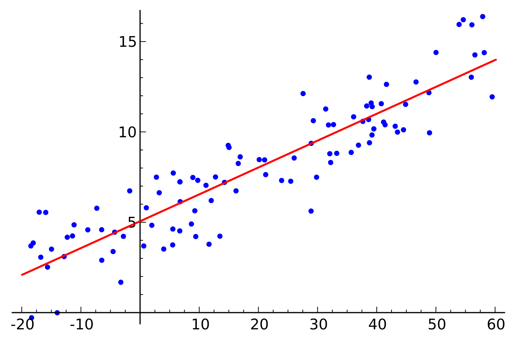

# 2. Simple Linear Regression

- Regression(회기)
- Linear Regression
- Hypothesis(가설)
- Which hypothesis is better?
- Cost, Cost function
- Goal: Minimize cost(비용 최소화)

## Regression

- 후퇴, 퇴보의 의미가 아님
- 'Regression toward the mean'의 줄임말
- mean = 전체 평균
- 전체적으로 데이터들은 전체 평균으로 되돌아가려는 속성이 있다는 의미

## Linear Regression

- 
- 참조:https://en.wikipedia.org/wiki/Linear_regression#/media/File:Linear_regression.svg
- 데이터를 가장 잘 대변하는 직선의 방정식(기울기와 y절편)을 찾는 것
- y=ax+b

- 가설: 데이터와 가장 가까운 직선의 방정식인 H(x) = Wx + b
- 그러나 실제 데이터가 직선과 완벽히 일치하는 것이 아니므로 데이터와 직선 사이에는 거리가 있다.
  - 이 거리를 비용(Cost)이라고 하고 H(x)-y로 표현한다.
  - 이 Cost를 최소로 되도록 하고 싶음
  - 그러나 문제가 생길 수 있음
  - 왜냐하면 음수가 있기 때문에..! => 합산할 때 의미가 읎다..
  - 그래서 제곱해서 사용
  - 에러값을 제곱해서 평균을 내는 것을 비용함수로 사용
  - Cost = 오차제곱의 평균
  - 

- Cost의 최솟값을 찾는 것이 목표!!