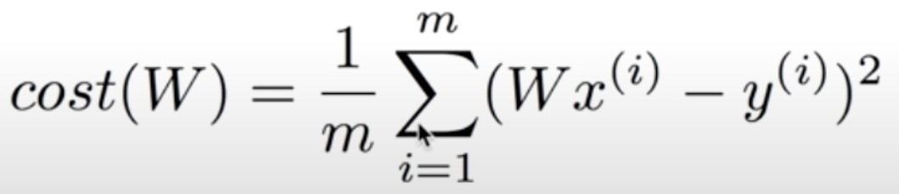

# 02. Simple Linear Regression LAB

## Hypothesis and Cost

**Hypothesis**   H(x) = Wx + b

**Cost**    



- Error 제곱의 평균값이 Cost
- cost가 최소화되는 기울기와 y절편값 구하는 게 러닝학습

## Build hypothesis

H(x) = Wx + b

```python
x_data = [1,2,3,4,5]
y_data = [1,2,3,4,5]

W = tf.Variable(2.9) # 랜덤값 
b = tf.Variable(0.5) # 랜덤값 

# hypothesis = W * x + b
hypothesis = W * x_data + b
```

cost(W, b) 

```python
cost = tf.reduce_mean(tf.square(hypothesis - y+data))
```

- tf.reduce_mean()

  - 맵리듀스의 리듀스

  - 차원이 하나 줄어들면서 mean을 구한다

  - ```python
    v = [1., 2., 3., 4.]  #1차원
    tf.reduce_mean(v) # 2.5 , 0차원으로 줄음
    ```

- tf.square()

  - ```python
    tf.square(3)  # 9
    ```

## Gradient descent

- Gradient: 경사, 기울기

- descent: 하강

- 경사 하강 알고리즘, 경사 하강법

- 경사 하강하며 cost를 minimize하게 하는 W, b 찾는 알고리즘

- ```python
  #learning_rate initialize
  learning_rate = 0.01
  
  
  #Gradient descent
  #with구문과 함께 tf.GridentTape 사용하여 정보를 tape에 기록
  with tf.GradientTape() as tape:
      hypothesis = W * x_data + b
      cost = tf.reduce_mean(tf.square(hy[othesis - y_data]))
  
  #개별 미분값(기울기)을 그대로 반환
  #W에 대한 미분값은 w_grad, b의 미분값은 b_grad
  W_grad, b_grad = tape.gradient(cost, [W, b])
  
  #A.assign_sub(B)는 이런 뜻 
  #A -= B
  W.assign_sub(learning_rate * W_grad)
  b.assign_sub(learning_rate * b_grad)
  ```

- learning_rate는 굉장히 작은 값을 사용함

- 기울기를 얼만큼 반영할 것인지를 결정하는 아이

- #Gradient descent 아래부분들을 여러번 돌려서 여러 번 w, b 업데이트

- ```python
  W = tf.Variable(2.9)
  b = tf.Variable(0.5)
  
  for i in ragnge(100):
      #Gradient descent
      with tf.GradientTape() as tape:
          hypothesis = W * x_data + b
          cost = tf.reduce_mean(tf.square(hypothesis - y_data))
      W_grad, b_grad = tape.gradient(cost, [W, b])
      W.assign_sub(learning_rate * W_grad)
      b.assign_sub(learning_rate * b_grad)
      if i % 10 == 0:
          print("{:5}|{:10.4}|{:10.4}|{10.6f}".format(i, W.numpy(), b.numpy(), cost))
  ```

- [Full Code]

- ```python
  import tensorflow as tf
  tf.enable_eager_execution()
  
  #Data
  x_data = [1,2,3,4,5]
  y_data = [1,2,3,4,5]
  
  #W, b initialzie
  W = tf.Variable(2.9)
  b = tf.Variable(0.5)
  
  learning_rate = 0.01
  
  for i in ragnge(100+1): # W, b update
      #Gradient descent
      with tf.GradientTape() as tape:
          hypothesis = W * x_data + b
          cost = tf.reduce_mean(tf.square(hypothesis - y_data))
      W_grad, b_grad = tape.gradient(cost, [W, b])
      W.assign_sub(learning_rate * W_grad)
      b.assign_sub(learning_rate * b_grad)
      if i % 10 == 0:
          print("{:5}|{:10.4}|{:10.4}|{10.6f}".format(i, W.numpy(), b.numpy(), cost))
  ```