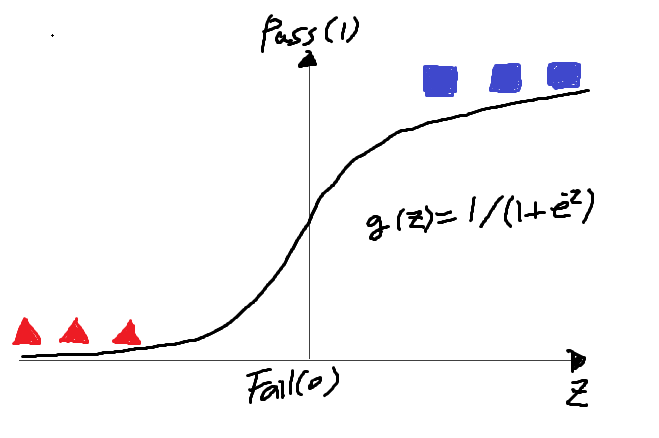
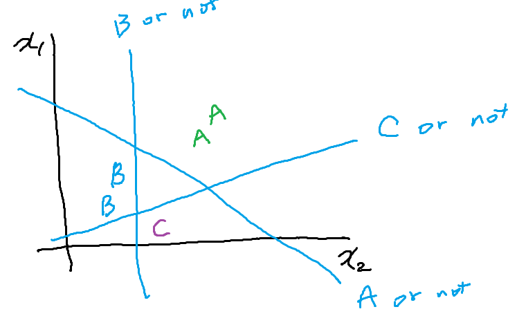
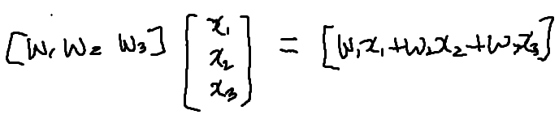

# 6. Softmax classification

## Logistic Regression

H(x) = WX

- 0이냐 1이냐의 분류가 전혀 안 됨

Z = H(X), g(z) = 0 또는 1로 나오면 좋겠다.

그래서 나온 것이 시그모이드 함수

- H`(x) = g(H(x))

## Multinomial classification

- 클래스가 여러 개

- | x1(hours) | x2(attendance) | y(grade) |
  | --------- | -------------- | -------- |
  | 10        | 5              | A        |
  | 9         | 5              | A        |
  | 3         | 2              | B        |
  | 2         | 4              | B        |
  | 11        | 1              | C        |

- 

- 

- 위의 것처럼 다 따로 쓸 것 없이 밑의 표현처럼 한꺼번에 늘여서 쓴다.

