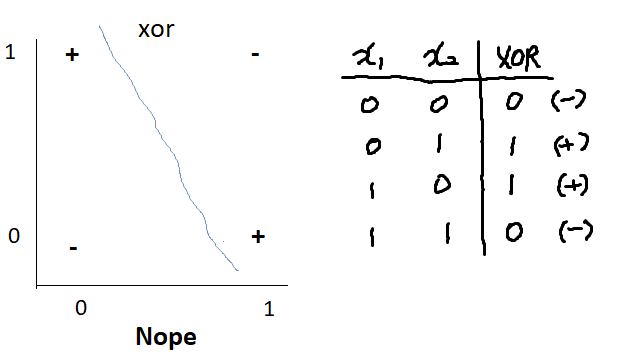
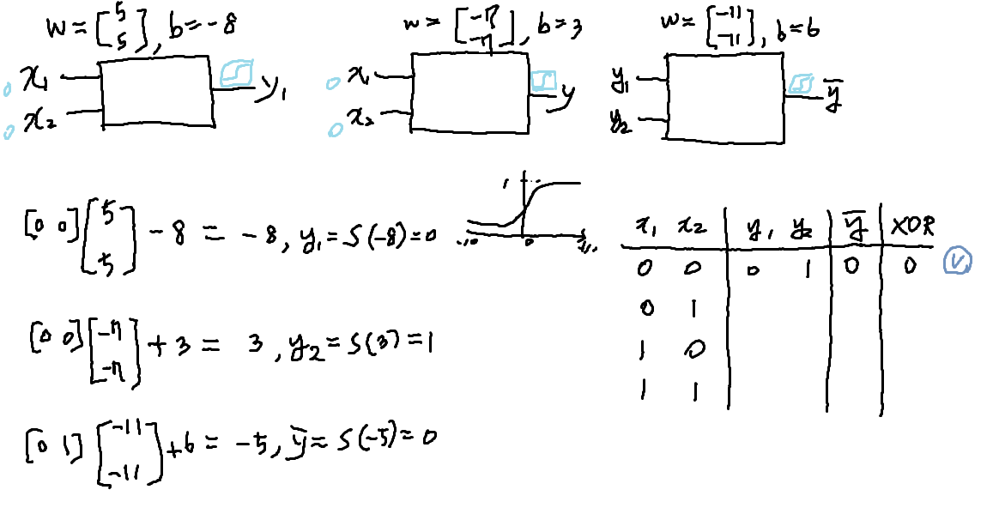
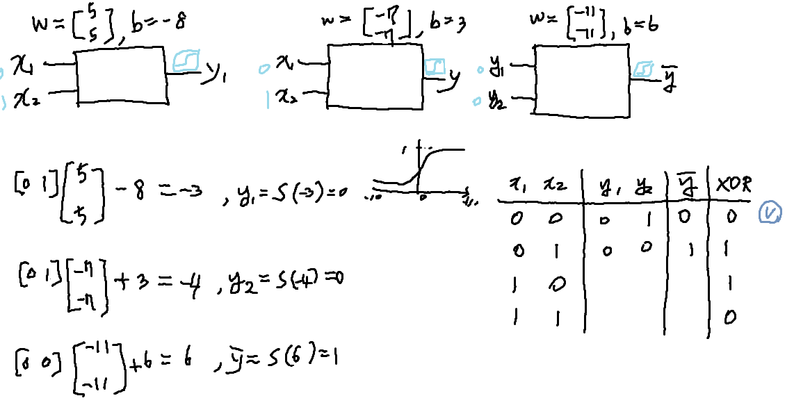
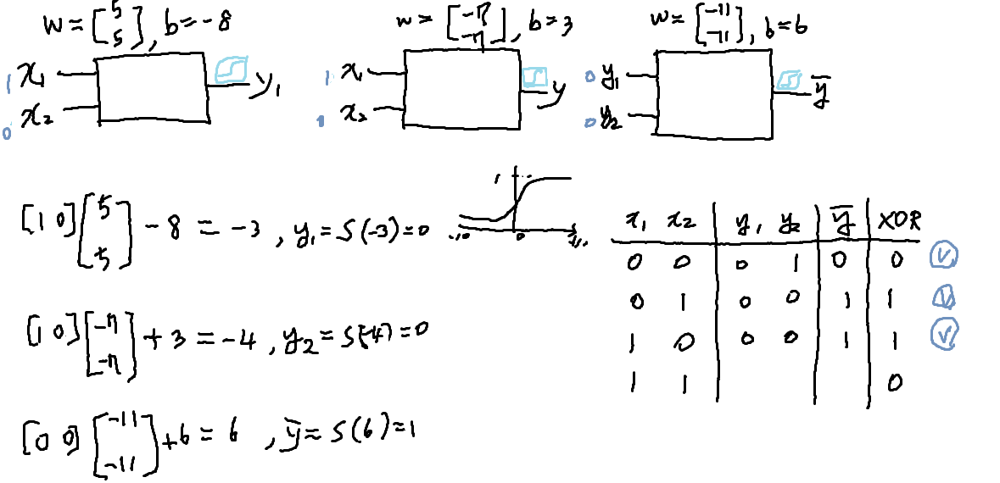
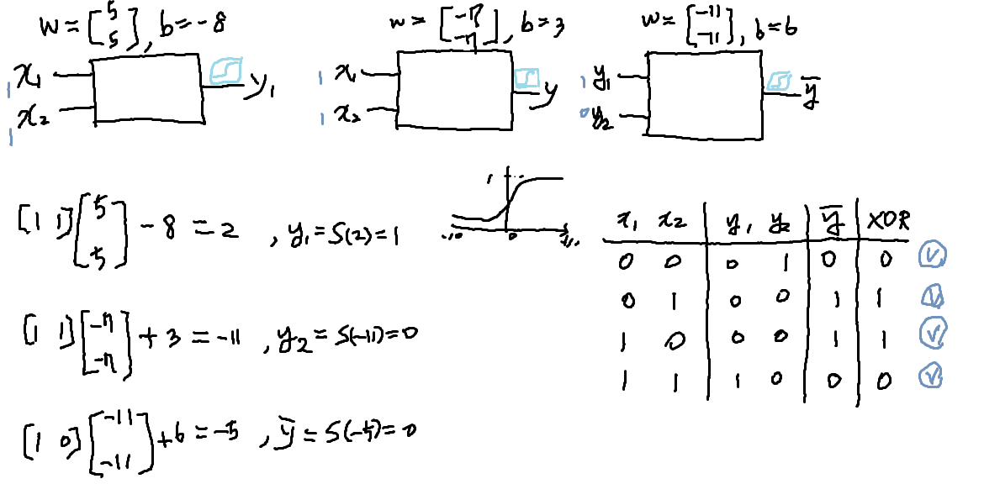
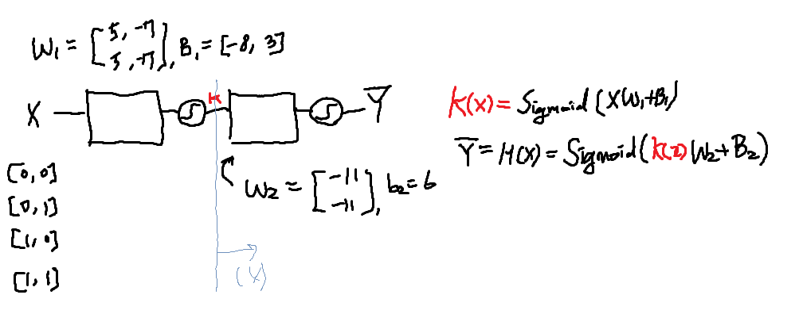

# Lec9-1:XOR 문제 딥러닝으로 풀기

## One logistic regression unit cannot separate XOR

- 굉장히 많은 사람들에게 절망을 준 문제
- linear regression으로는 안 된다
- 그러면 여러 개로 하면 어떨까? => 풀 수는 있다.
- 그런데 복잡한 네트워크에 들어있는 w, b 를 어떻게 학습할 수 있는가 => 불가능하다

## XOR using NN



## Neural Net

- 

- 

- 

- 

## Forward propagation

- 

- 이 값들 말고 다른 조합의 값(W, b)들이 존재할까?
- 만약 된다면 찾아보아라

## NN

- multinomial classficatino과 위 그림이 상당히 유사

- 위 그림은 아래처럼 표현이 가능
- 

```python
# NN
K = tf.sigmoid(tf.matmul(X, W1) + b1)
hypothesis = tf.sigmoid(tf.matmul(K, W2) + b2)
```

- 어떻게 자동적으로 w1, w2, b1, b2를 학습할 수 있을 것인가?