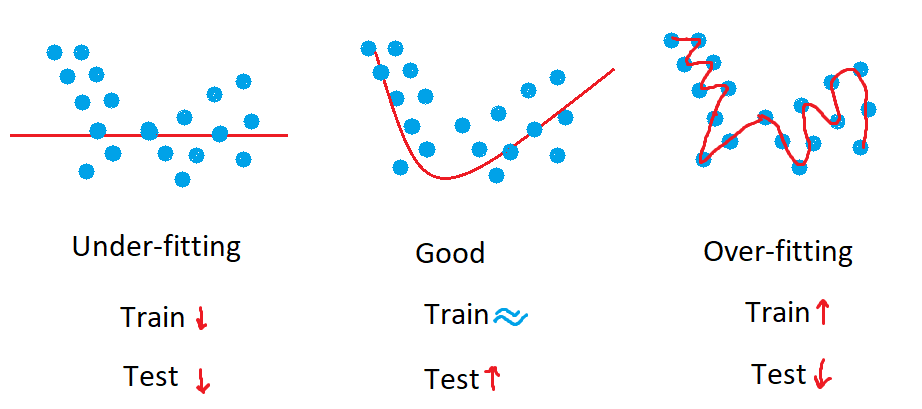
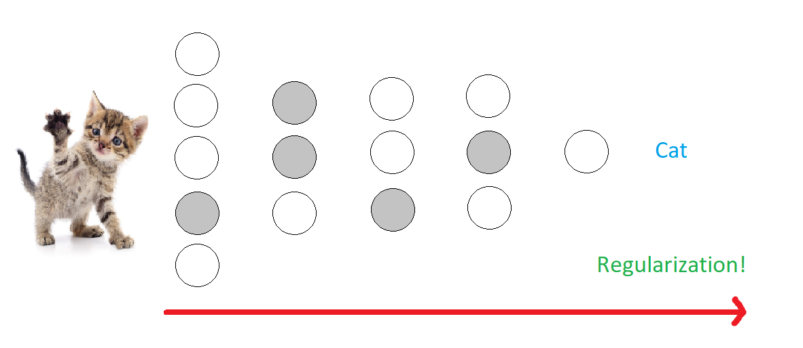

# Lab10-3. Dropout

- Dropout
- Code
  - load dataset
  - create network
  - define loss function
  - experiments
    - parameters
    - model
    - eager mode

## Dropout

- 샘플들의 분포가 다음과 같다 

- regression하는 선이 핑크색 선
- Underfitting과 overfitting 피하여 Good 지향
- Dropout이 그런 방법 중 하나

- 고양이인지 아닌지 맞추는 네트워크

- 뉴런들을 모두 활용 -> 고양이인지 아닌지 판단

- 각각의 뉴런들 중 몇 개의 일부분을 끄고 학습하는 것이 Dropout

- 랜덤으로 어떤 노드 끌 것인지가 설정이 됨

- 학습 시 일부의 노드만 갖고 학습하는 방식이 Dropout

- 이렇게 진행한 후 모든 뉴런들 이용해서 고양이인지 아닌지 판단하게 됨

  - Regularization
  - 기존에는 고양이의 모든 부분들(갈색, 등등)으로 맞추었다면 Drop 이용 시 귀만 갖고 고양이인지 아닌지 판단
  - 테스트 데이터 셋에 검은색 고양이, 얼룩 고양이 등의 새로운 고양이 들어와도 잘 맞추게 되는 기법
  - 

  - (사진: https://www.foodnmed.com/news/articleView.html?idxno=18296 참고)