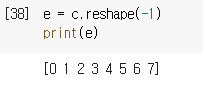
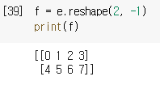

# 2. 학습 준비

- 아나콘다+주피터 말고 구글코랩 사용할 것임

## 2.2 구글 코랩 사용

- 클라우드에서 동작하는 연구 및 교육용 파이썬 실행 환경
- 
  - Shift+Enter로 하면 실행 후, 다음 라인으로 넘어가지만 Ctrl+Enter로 명령문 실행 시 실행만 됨
- 

### 2.2.3 GPU 사용

- CPU보다 병렬연산, 행렬 연산 속도 뛰어나서 딥러닝에 많이 사용됨

- 수치계산용으로는 넘파이 라이브러리 사용, GPU 사용 시 주석해제에는 쿠파이 모듈 이용
- 구글 코랩에서 GPU 사용 시 이용 시간에 제한 있음

### 2.2.4 파일 사용

- .ipynb 형식 주로 사용
- 구글 드라이브에 한번 업로드해둔 다음, 파일-> 노트 열기 선택 시 표시되는 화면의 구글 드라이브 탭에서 해당 파일 실행 가능
- 

## 2.3 파이썬 기초

### 2.3.1 변수와 변수형

- 변수 선언 할 필요 없음

  - `a=123`
  - 이러면 그냥 변수 생성

- 변수 타입 명시 안 해도 됨, 정수형 변수에 문자열 입력 시 변수가 문자형으로 바뀜

- **내장 자료형**: 변수에 바로 입력하는 자료형

- 주요 내장 자료형의 종류

  - ```python
    # 다양한 내장 데이터형
    a = 123				# 정수형(int)
    b = 123.456			# 부동소수점형(float)
    c = "Hello World!"  # 문자열형(str)
    d = True			# 논리형(bool)
    e = [1, 2, 3]		# 리스트형(list)
    ```

  - type 함수 실행 시 변수 타입 결과 확인 가능

    - ```cmd
      >>> a = 123
      >>> print(type(a))
      <class 'int'>
      ```

  - 논리형의 덧셈이 가능

    - True + False = 1

    - ```python
      >>> a = True; b = False
      >>> print(a+b)
      1
      ```

    - True: 1, False: 0

    - `;`: 여러 개의 명령 나열 가능

  - 부동소수점 값은 지수형식 표기 가능, e 이용해 소수 표시 가능

### 2.3.2 연산자

- 파이썬 연산자는 다른 프로그래밍 언어와 큰 차이 없음

- ```python
  >>> a = True; b = False
  >>> print(a+b)
  1
  >>> a = 3; b=4
  >>> c = a+b
  >>> print(c)
  7
  >>> d = a < b
  >>> print(d)
  True
  >>> e = 3 < 4 and 4 < 5
  >>> print(e)
  True
  ```

- 다른 연산자는 다 똑같은데 Python만 독특한 것들

  - | 분류       | 연산자 | 의미                           |
    | ---------- | ------ | ------------------------------ |
    | 산술연산자 | //     | 나눗셈(정수, 소수점 이하 버림) |
    |            | **     | 거듭제곱                       |
    | 논리연산자 | in     | 포함여부                       |

  - `+`연산자는 문자열이나 리스트의 결합에도 이용 가능

    - ```python
      >>> a = "Hello" + "World" # 문자열 결합
      >>> print(a)
      HelloWorld
      >>> b = [1, 2, 3] + [4, 5, 6] # 리스트 결합
      >>> print(b)
      [1, 2, 3, 4, 5, 6]
      ```

### 2.3.3 리스트

- 여러 개의 값 다룰 때 사용

- 대괄호와 쉼표 사용

- 파이썬 리스트는 어떤 변수형 값도 포함 가능, 리스트 속 리스트 포함도 가능

- 배열과 달리 각 원소 값을 추출하거나 변경이 가능함

- ```python
  >>> a = [1, 2, 3, 4, 5]
  >>> b = a[2]
  >>> print(b)
  3
  >>> a.append(6)
  >>> print(a)
  [1, 2, 3, 4, 5, 6]
  >>> a[2] = 7
  >>> print(a)
  [1, 2, 7, 4, 5, 6]
  ```

### 2.3.4 튜플

- 리스트처럼 여러 개의 값 다룰 때 사용하지만 원소를 추가나 삭제, 변경이 불가능

- 전체를 소괄호`()`로 감싸고 각 원소값은 쉼표로 구분

  - ```python
    >>> a = (1, 2, 3, 4, 5)
    >>> b = a[2]
    >>> print(b)
    3
    ```

- 원소가 하나뿐이면 값 뒤에 쉼표가 필요함

  - `(3, )`

- 튜플과 리스트의 원소는 한꺼번에 변수에 입력 가능

  - ```python
    >>> a = [1, 2, 3]
    >>> a1, a2, a3 = a
    >>> print(a1, a2, a3)
    1 2 3
    >>> b = [4, 5, 6]
    >>> b1, b2, b3 = b
    >>> print(b1, b2, b3)
    4 5 6
    ```

### 2.3.5 딕셔너리

- 키(key)와 값(value) 을 조합해 저장

- 문자열을 키로 매칭한 딕셔너리 생성, 값 얻거나 변경, 원소 추가하는 등의 작업을 함

- ```python
  >>> a = {"Apple":3, "Pineapple":4}
  >>> print(a["Apple"])
  3
  >>> a["Pineapple"] = 6
  >>> print(a["Pineapple"])
  6
  >>> a["Melon"] = 3
  >>> print(a)
  {'Apple': 3, 'Pineapple': 6, 'Melon': 3}
  ```

### 2.3.6 if문

- 파이썬은 중괄호 사용이 아니라 반드시 들여쓰기를 해야 함
  - 들여쓰기 안 한 행이 나오면 그 직전의 블록은 end
    - 4칸의 공백으로 한 번 들여쓰기 표시하는 경우가 대부분
- 

### 2.3.7 for 문

- 반복문 사용시 for 문 사용
- 반복 범위 지정 위해서 range 함수를 in 연산자 함께 이용

- 대괄호로 감싼 인수는 생략 가능
  - range(3)은 0부터 2까지의 범위

- 

### 2.3.8 함수

- 여러 행으로 작성된 명령을 하나로 정리 가능
- def 뒤에 함수명 쓰고 () 안에 인수를 넣음
- return 뒤의 값이 반환됨
- 

- 함수는 `*` 붙인 튜플 이용해서 여러 개의 인수를 한 번에 전달 가능함
- 

### 2.3.9 변수의 범위

- 지역 변수: 함수 안에 정의된 변수
- 전역 변수: 함수 밖에 정의된 변수
  - 어디서나 참조 가능
- 

- 파이썬에서는 함수 안에서 전역변수에 값 입력 시도 시, 새로운 지역변수로 간주
- 함수 안에서 전역변수 a 값 입력해도 전역변수 a값 변경 불가

- 

- 함수 안에서 전역변수 값 변경하려면 global 키워드 사용해서 변수가 지역변수 아니라고 명시해야 함
- 

### 2.3.10 클래스

- 객체 지향에는 클래스와 인스턴스라는 개념이 있음

- 클래스: 설계도(붕어빵 틀), 인스턴스: 실체(붕어빵)

- 클래스 이용 시 여러 메소드 정리 가능

- 메소드는 함수와 유사하고 def로 생성

- ```python
  class Calc:
      def __init__(self, a):
          self.a = a
          
      def add(self, b):
          print(self.a + b)
      
      def multiply(self, b):
          print(self.a * b)
  ```

  - self 사용해서 다른 메소드나 외부에서 접근 가능한 인덱스 변수 다룰 수 있음
  - `__init__`: 생성자
    - 인스턴스의 초기값 설정
    - 인수로 받은 값을 인스턴스 변수 a에 입력
  - Calc 클래스에서 인스턴스 생성하고 메소드 호출 가능
  - Calc(3)으로 인스턴스 생성, 변수 Calc에 저장

- 

- 클래스는 상속 개념이 있음
- 클래스 상속받으면 기존 클래스를 승계해서 새로운 클래스 정의 가능

- 

## 2.4 넘파이와 맷플롯립

- 넘파이는 파이썬의 확장 모듈, 간단한 코드로 데이터 효율적으로 처리 가능
  - 다차원 배열 충실하게 지원, 딥러닝에 유용
- 맷플롯립은 파이썬 외부 모듈, 그래프나 이미지 표시, 간단한 애니메이션 생성 등이 가능

### 2.4.1 모듈 임포트

- 모듈: 재사용 가능한 파이썬 스크립트 파일
- import 명령어로 모듈 이용 가능
- 넘파이와 맷플롯립 모듈 사용하려면 다음과 같이 작성해야 함

```python
import numpy as np
import matplotlib.pyplot as plt
```

- np라는 이름으로 넘파이 모듈, plt 라는 이름으로 맷플롯립의 파이플롯 모듈 다룰 수 있음
  - 파이플롯은 그래프 꾸미는 데 사용함
- 아나콘다 환경에서는 다음과 같은 명령어를 코드의 첫 부분에 입력해야 함
  - `$matplotlib inline`

### 2.4.2 넘파이 배열

- 배열과 벡터 이용 시 넘파이의 배열을 이용

- 넘파이의 배열은 array 함수 이용해서 파이썬 리스트로 간단히 생성 가능함
- 

- 외부 모듈 함수 이용 시에는 모듈명과 함수명 사이에 온점을 쓴다.
  - 배열을 2차원 행렬로 만들 수 있음
  - 
  - 3차원 배열도 만들 수 있음
  - 

- 배열의 형태(각 차원의 원소수)는 shape 함수로 확인 가능
  - 
  - 배열의 형태는 튜플 형태로 출력됨
  - len함수를 배열에 이용하면 첫번째 차원의 원소 갯수를 셈
  - 

### 2.4.3 배열을 생성하는 다양한 함수

- 넘파이에는 array 함수 외에도 배열 생성 함수가 많음

- 

- zeros 함수와 ones 함수는 인수에 튜플 지정 가능함
- 생성되는 배열은 튜플 형태의 다차원 배열이 됨
- 

- 생성되는 배열은 튜플 형태의 다차원 배열이 됨
- linspace 함수 이용하면 지정한 범위에서 일정한 간격으로 원소가 나열되는 배열 생성 가능
  - `linspace(시작숫자, 끝숫자, 원소 수)`
  - 
  - 3번째 인수는 생략 가능, 생략하면 배열의 원소 수는 50이 됨
  - 
  - linspace함수는 그래프의 가로, 세로축의 값을 나타낼 때 자주 이용됨

### 2.4.4 reshape를 이용한 형태 변환

- 넘파이의 reshape 메소드 사용해서 배열 형태 변환 가능
- 원소 수가 8개인 1차원 배열을 (2, 4) 형태의 2차원 배열로 변환시킴
- 

- 

- 총 원소 수만 일치하면 어떤 형태든 reshape으로 변환 가능
- reshape의 인수를 -1로 지정하면 어떤 형태의 배열도 1차원 배열로 변환 가능
  - 
- 여러 개의 인수 중 하나를 -1로 지정하면 해당 차원의 원소 수를 자동으로 계산해줌
  - 넘파이가 자동으로 8을 2로 나눠서 자동으로 4로 계산함
  - 

### 2.4.5 배열 연산

- 배열과 배열, 배열과 수치 간에도 연산 가능
- 

- 배열간 연산도 가능

  - 연산되는 배열의 형태가 서로 다르면 오류 발생

  - 그러나 브로드캐스트 조건 만족 시 형태가 다른 배열끼리도 연산이 가능하다.

  - 

  - **브로드캐스트**: 특정 조건 만족하면 형태 다른 배열 간에도 연산 가능한 것

    

  - 이 경우 배열 b는 1차원 배열을 수직으로 나열한 2차원 배열이 되어서 연산의 대상이 됨
  - 배열의 형태가 일치하면 형태가 다른 배열 간에도 브로드캐스트 이용해 연산 가능

### 2.4.6 원소 값에 접근

- 2차원 배열의 경우, 원소 값 얻을 때, 인덱스를 가로, 세로 2개를 지정
  - 쉼표 구분 또는 인덱스 입력한 []를 2개 나열
- 

- 넘파이의 **슬라이싱** 기능 이용 시, 배열의 일부분 값 추출하거나 변경 가능함

  - `배열명[이 인덱스 이상: 이 인덱스 미만]`
    - 1차원 배열 경우, 이런 형식으로 배열의 일부 원소 값에 접근 가능
    - `:` 이용해서 범위 지정
  - 

  - 추출한 배열의 차원은 원래 배열의 차원과 같음
  - 모든 원소 지정도 가능

- 

- 2차원 배열의 경우, 쉼표로 구분해서 각 차원의 범위를 지정함

- 

### 2.4.7 그래프 그리기


- scatter 함수 이용해 산포도 생성 가능
  - 

### 2.4.8 이미지 생성

- 파이플롯의 imshow 함수는 배열을 이미지로 출력 가능
- 

