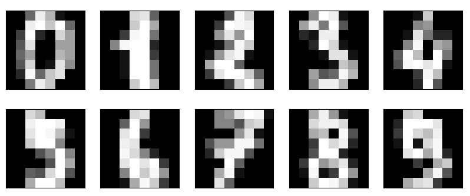

# Chapter3. 딥러닝 기초

## 3.1 딥러닝 개요

- 다수의 층으로 구성된 신경망을 사용하는 머신러닝의 한 방법
- '뉴런'이라는 개별 단위로 구성됨
- 각 입력마다 C = W*x + b를 만족시킴
  - W: 가중치
  - x: 입력값
  - b: bias, 편향
  - C를 활성화 함수 통해 처리하면 출력이 됨
  - 이런 뉴런들을 여러 층을 만들고 연결하면 신경망이 구축됨
  - 신경망 전체에 입출력 존재, 출력과 정답과의 오차가 줄어들드록 파라미터 조정하면서 학습이 진행
- **역전파**(오차 역전파): 1개 층씩 반대 방향으로 오차 전파 -> 가중치와 편향 수정
  - 신경망의 여러 파라미터가 반복적으로 조정되면서 네트워크는 조금씩 학습, 적절한 예측 가능해짐
  - 여러 층으로 구성된 신경망의 학습 = 딥러닝(심층학습)

### 3.1.2 층의 방향과 층의 개수

- 은닉층: 입력층과 출력층 사이에 위치한 여러 개의 층

- 순전파: 입력 -> 출력 방향으로 정보 전달
- 역전파: 출력 -> 입력 방향으로 정보 전달

### 3.1.3 경사 하강법

- 오차의 그래프가 있음
- 오차 E 를 가중치 w로 편미분한 값은 기울기인데 기울기가 최소가 되는 지점을 찾아야 함
- 실제로는 곡선의 형태를 알기 어려우니까 오차가 최소가 되는 방향으로 조금씩 가중치를 변화시킴
- 오차의 기울기가 조금씩 하강하도록 가중치 조금씩 줄여가면서 Global minimum을 찾는다.
- **확률적 경사 하강법**은 편미분 이용함

### 3.1.4 에포크와 배치 

- **에포크**: 모든 훈련 데이터를 1회 학습하는 것

- 샘플: 입력값, 정답값 한 쌍
- **배치**: 샘플 그룹
  - 1회 학습에 1개 배치가 사용됨
- **배치 사이즈**: 배치에 포함된 샘플 데이터의 개수
- **미니 배치**: 훈련 데이터를 작은 크기의 배치로 분할, 배치마다 학습시키는 것
- 배치 사이즈가 학습 시간과 성능에 영향을 줌

## 3.2 전결합층 순전파

- 패쓰함

## 3.3 전결합층 역전파

- 전결합층: 일반적인 신경망의 층

### 3.3.1 역전파 수식

- 강의를 듣든지 해야 할 듯.(1도 이해 안 감)

### 3.3.3 역전파를 코드로 구현

```python
#x: 입력 행렬 w: 가중치 행렬 delta: d 행렬
grad_w = np.dot(x.T, delta) # w의 기울기
grad_b = np.sum(delta, axis = 0) # b의 기울기
grad_x = np.dot(delta, w.T) # x의 기울기
```

### 3.4 전결합층 구현

#### 3.4.1 공통 클래스 구현

- 공통 부분은 BaseLayer 클래스로 구현함
- 최적화 알고리즘 구현 위해 확률적 경사 하강법 구현
- eta: 학습률
- `self.`가 붙어있는 변수는 다른 메소드나 외부와 공유하는 변수
- 아다그라드나 아담 등의 최적화 알고리즘 구현 시 BaseLayer 클래스 조금 변경함

```python
class BaseLayer:
    def update(self, eta):
        self.w -= eta * self.grad_w
        self.h -= eta * self.grad_b
```

#### 3.4.2 은닉층 구현

- 초기화 위해 `__init__` 메소드, 순전파를 위한 forward 메소드, 역전파 위한 backward 메소드 포함함

- ```python
  class MiddleLayer(BaseLayer):
      def __init__(self, n_upper, n):
          # He 초깃값
          self.w = np.random.randn(n_upper, n) * np.sqrt(2/n_upper)
          self.b = np.zeros(n)
  
      def forward(self, x):
          self.x = x
          self.u = np.dot(x, self.w) + self.b
          self.y = np.where(self.u <= 0, 0, self.u)
  
      def backward(self, grad_y):
          delta = grad_y * np.where(self.u <= 0, 0, 1) # ReLu 미분
  
          self.grad_w = np.dot(self.x.T, delta)
          self.grad_b = np.sum(delta, axis=0)
          self.grad_x = np.dot(delta, self.x.T)
  ```

- **`__init__`메소드**

  - n_upper는 앞 층의 뉴런 수,  n은 해당 층의 뉴런 수

  - 가중치 self.w의 초깃값은 평균이 0, 표준편차는 `σ = sqrt(2/m)`
    - m: 앞 층의 뉴런 수 
    - He 초기값은 ReLu 함수에 최적화되어있다.

- forward 메소드

  - y = (해당 확률/n개의 확률 합)
  - n: 이 층의 뉴런 수
  - 첨자: 해당 층 뉴런의 인덱스 의미
  - y > 0 임은 분명하고, 층의 모든 뉴런에서 총합 구하면 1
    - 확률 표현 시 소프트맥스 함수가 자주 사용됨
  - 코드에서는 넘파이의 sum 함수 이용해서 소프트맥스 함수 구현함
    - axis=1로 지정, 샘플마다 총합 구함, keepdims= True로 지정 -> 배열의 차원 유지(뭔 소린지 모르겠다.)

- backward 메소드

  - 출력 기울기와 활성화함수를 편미분한 것의 곱
  - 코드에서는 인수인 grad_y가  출력 기울기임
  - y의 u에 대한 도함수는 u<=0 일 때 0, u >0 일 때 1
  - `np.where(self.u <= 0, 0, 1)`

## 3.5 단순한 딥러닝 구현

### 3.5.1 손글씨 숫자 이미지 데이터 확인

- 사이킷런에는 몇 가지 학습용 데이터 세트가 준비되어 있음

- ```python
  import numpy as np
  import matplotlib.pyplot as plt
  from sklearn import datasets
  
  digits_data = datasets.load_digits()
  
  n_img = 10
  plt.figure(figsize=(10, 4))
  for i in range(n_img):
      # 입력 이미지
      ax = plt.subplot(2, 5, i+1)
      plt.imshow(digits_data.data[i].reshape(8, 8), cmap="Greys_r")
      ax.get_xaxis().set_visible(False) # 축 표시 안 함
      ax.get_yaxis().set_visible(False)
  plt.show()
  
  print("데이터 형태:", digits_data.data.shape)
  print("레이블:", digits_data.target[:n_img])
  ```

- 

- ```cmd
  데이터 형태: (1797, 64)
  레이블: [0 1 2 3 4 5 6 7 8 9]
  ```

- 8 x 8 크기의 이미지들이고 이런 손글씨 숫자 이미지 1797장이 데이터 셋에 포함됨

### 3.5.2 데이터 전처리

- ```python
  from sklearn.model_selection import train_test_split
  
  input_data = np.asarray(digits_data.data)
  input_data = (input_data - np.average(input_data)) / np.std(input_data)
  
  correct = np.asarray(digits_data.target)
  correct_data = np.zeros(len(correct), correct)
  for i in range(len(correct)):
      correct_data[i, correct[i]] = 1 # 원핫인코딩
  
  x_train, x_test, t_train, t_test = train_test_split(input_data, correct_data)
  ```

- 입력 데이터는 각 데이터에 평균값 빼고 표준편차로 나눠서 평균을 0, 표준편차를 1로 만듦

- 정답 데이터 레이블은 원핫 인코딩으로 변환

- `[0 0 1 0 .... 0 0]`
  - 원핫 인코딩은 하나의 값만 1(레이블이 표시된 부분), 나머지 값은 모두 0

- 입력과 정답 데이터를 훈련 데이터와 테스트 데이터로 분할
- 사이킷런의 train_test_split 함수 사용
  - train_test_split은 기본적으로 임의 추출한 25%의 데이터를 테스트 데이터에 할당, 나머지 데이터를 훈련 데이터로 남겨둠

### 3.5.3 순전파와 역전파

- 각 층 초기화해서 리스트 형식으로 저장

```python
layers = [MiddleLayer(img_size*img_size, n_mid),
          MiddleLayer(n_mid, n_mid),
          OutputLayer(n_mid, n_out)]

# 순전파
def forward_propagation(x):
    for layer in layers:
        layer.forward(x)
        x = layer.y
    return x

# 역전파
def backpropagation(t):
    grad_y = t
    for layer in reversed(layers):
        layer.backward(grad_y)
        grad_y = layer.grad_x
    return grad_y

# 파라미터 갱신
def update_params():
    for layer in layers:
        layer.update(eta)
```

- 역전파에서는 reversed 함수를 사용해 반복 처리 방향을 반대로 바꿀 수 있음

### 3.5.4 미니 배치 구현

- 랜덤하게 미니 배치 구성, 순전파, 역전파, 파라미터 갱신 실행

- ```python
  n_batch = len(x_train) // batch_size # 1에포크당 배치 개수
  for i in range(epochs):
      
      # 학습
      index_random = np.arrange(len(x_train))
      np.random.shuffle(index_random) # 인덱스를 임의로 섞기
      for j in range(n_batch):
          
          # 미니배치 구성
          mb_index = index_random[j*batch_size : (j+1)*batch_size]
          x_mb = x_train[mb_index, :]
          t_mb = t_train[mb_index, :]
          
          # 순전파와 역전파
          forwrad_propagation(x_mb)
          backpropagation(t_mb)
          
          # 파라미터 갱신
          update_params()
  ```

  - 임의로 섞인 인덱스 이용, 입력과 정답 쌍 데이터를 배치 사이즈만큼 임의 추출
  - 추출된 미니 배치 사용 -> 순전파와 역전파 실행, 파라미터 갱신

## 3.6 손글씨 숫자 이미지 인식의 전체 코드

- 해봤는데 에러생김(n_out 타입이 np.zeros에 안 맞아서)

