# Chapter8. GAN

## 8.1 GAN 소개

- GAN(Generative Adversarial Networks, 생성적 적대 신경망):
  - 생성자와 식별자라는 신경망 2개가 서로 경쟁하면서 학습하는 생성 모델의 하나
  - 이미지 생성에 자주 이용됨
  - 생성자: 
    - 가짜 데이터를 만들어 식별자를 속이려는 목적 가짐
    - 랜덤 노이즈를 입력해 가짜 데이터 만들어서 식별자가 구분 못하도록 학습 진행
  - 식별자:
    - 생성자가 만든 가짜를 식별하는 목적 있음
    - 원본 데이터, 생성자가 만든 데이터 = 훈련 데이터
  - 생성자와 식별자가 경쟁하면서 원본과 비슷한 그리을 그리게 됨
  - Epoch가 커질수록 원본과 비슷한 이미지들이 생성됨

### 8.1.2 DCGAN

- 컨볼루션 신경망을 이용하는 GAN
- 컨볼루션 신경망: 여러 개 이미지를 필터로 처리하는 컨볼루션층을 여러 겹 쌓음
  - DCGAN은 식별자와 생성자 각각에 컨볼루션 신경망층과 반대 작업을 실행하는 신경망층 사용
  - 입력으로 노이즈 데이터 사용, 여러 번 학습 반복 -> 이미지 생성
  - 컨볼루션층과 반대 구조: 이미지 크기가 커지고 개수 작아짐
  - 식별자는 일반적인 컨볼루션층 이용, 입력 이미지가 원본인지 식별
- GAN에서 CNN 사용하면 좋은 결과 내기도 한다

### 8.1.3 GAN의 용도

- 고해상도 이미지 생성
- 이미지 각색(ex. 유명 화가의 화풍 따라함)
- 이미지 합성

## 8.2 GAN의 구조

### 8.2.1 식별자의 학습 과정

- 식별자는 출력층의 뉴런 수가 1, 출력범위 0~1, 출력값 = 식별 결과
- 원본일수록 1에 가깝고 가짜일수록 0에 가까움
- 순전파 실행, 출력&정답의 오차 -> 가중치, 편향 등을 update(이 순서대로.)

### 8.2.2 생성자의 학습 과정

- 생성자, 식별자를 이용해서 순전파 실행
- 식별자 출력, 정답 사이 오차 계산
- 정답: 1, 역전파 실행 -> 기울기 계산 => 파라미터 갱신
- 생성자의 파라미터만 갱신됨
- 이 과정 반복, 식별자의 식별 결과가 1이 되도록 생성자를 학습시킴

### 8.2.3 오차의 정의

- 출력층의 뉴런 수: 1
- 출력층은 시그모이드 함수 사용 -> 범위는 0~1
- 오차함수는 식별자이 출력과 정답이 얼마나 차이나는지 나타냄
- GAN에서는 오차 이용해서 생성자, 식별자 번갈아 가면서 훈련시킴

## 8.3 GAN에 필요한 신경망층

###  8.3.1 생성자와 식별자의 구조

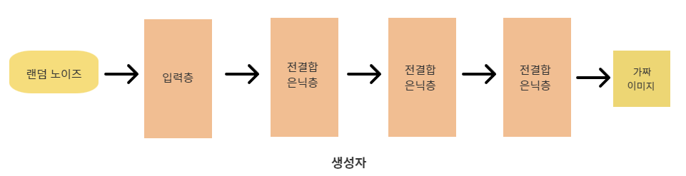

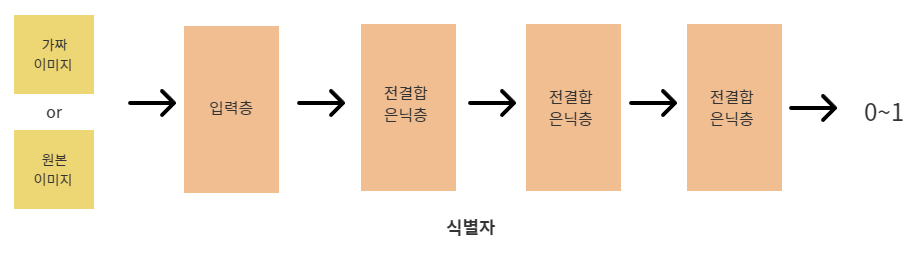

### 8.3.2 생성자의 출력층

- 신경망의 출력은 식별자의 입력이기도 하므로 식별자의 입력을 -1~1 로 두는 활성화 함수인 tanh를 사용

- ```python
  class GenOutLayer(BaseLayer):
      def __init__(self, n_upper, n):
          # 자비에르 초기화 기반의 초깃값
          self.w = np.random.randn(n_upper, n) / np.sqrt(n_upper)
          self.b = np.zeros(n)
  
      def forward(self, x):
          self.x = x
          u = np.dot(x, self.w) + self.b
          self.y = np.tanh(u)
  
      def backward(self, grad_y):
          delta = grad_y * (1 - self.y ** 2)
  
          self.grad_w = np.dot(self.x.T, delta)
          self.grad_b = np.sum(delta, axis=0)
          self.grad_x = np.dot(delta, self.w.T)
  ```

- 신경망층의 뉴런 수: 생성하는 이미지의 픽셀 수 

- 식별자와 함께 훈련할 때는 식별자의 역전파 함수로 얻은 grad_y 를 사용하여 delta 계산

### 8.3.3 식별자의 출력층

- 공식은 생략 

- 시그마를 계산해야 하는데 보통 결과는 y-t임

- ```python
  class DiscOutLayer(BaseLayer):
      def __init__(self, n_upper, n):
          # 자비에르 초기화 기반의 초기값
          self.w = np.random.randn(n_upper, n) / np.sqrt(n_upper)
          self.b = np.zeros(n)
  
      def forward(self, x):
          self.x = x
          u = np.dot(x, self.w) + self.b
          self.y = 1/(1+np.exp(-u)) # 시그모이드 함수
  
      def backward(self, t):
          delta = self.y - t
  
          self.grad_w = np.dot(self.w.T, delta)
          self.grad_b = np.sum(delta, axis=0)
          self.grad_x = np.dot(delta, self.w.T)
  ```

- 신경망의 출력은 식별결과 ==> 뉴런 수는 1

## 8.4 GAN의 구현

- 생성자, 식별자가 서로 경쟁하도록 훈련시킴 -> 생성자가 원본 이미지오아 비슷한 이미지 생성

### 8.4.1 순전파와 역전파

- 각 신경망층을 초기화, 순전파, 역전파 함수 정의

- 생성자의 각 신경망층은 리스트 gen_layers에 저장

- 식별자의 각 신경망층은 리스트 disc_layers에 저장했음

- ```python
  # 각 신경망층의 초기화
  gen_layers = [MiddleLayer(n_noise, 32),
                MiddleLayer(32, 64),
                GenOutLayer(64, img_size * img_size)]
  
  disc_layers = [MiddleLayer(img_size * img_size, 64),
                 MiddleLayer(64, 32),
                 DiscOutLayer(32, 1)]
  
  # 순전파 함수
  def forward_propagation(x, layers):
      for layer in layers:
          layer.forward(x)
          x = layer.y
      return x
  
  # 역전파 함수
  def backpropagation(t, layers):
      grad_y = t
      for layer in reversed(layers):
          layer.backward(grad_y)
          grad_y = layer.grad_x
          
      return grad_y
  ```

### 8.4.2 GAN의 훈련

- 훈련용 함수 정의
- 생성자 훈련시킬 때 생성자, 식별자 모두가 순전파와 역전파 실행
- 식별자의 파라미터는 갱신 안 함
  - train_model 함수에는 순전파와 역전파를 실행하는 prop_layers와 파라미터 갱신할 update_layers를 별도로 설정 가능함

```python
# train_model 함수
def train_model(x, t, prop_layers, update_layers):
    y = forward_propagation(x, prop_layers)
    backpropagation(t, prop_layers)
    update_params(update_layers)
    return (get_error(y, t), get_accuracy(y, t))
```

## 8.5 GAN에서 파생되는 기술

- 식별자, 생성자 번갈아 가면서 훈련
- 훈련 데이터에서 무작위로 미니 배치 학습 실행
- 식별자는 가짜와 원본의 이미지 각각을 대상으로 훈련시킴, 배치 사이즈 데이터를 절반으로 나눠서 사용
- 생성자 훈련시킬 때는 배치 사이즈 데이터 전체를 사용
- 식별자를 훈련시킬 때 가짜와 원본이미지의 정답은 각각 0과 1
- 생성자는 식별자가 진짜라고 판단하는 이미지를 만들기 때문에 정답은 1
- 생성자 훈련시킬 때는 생성자인 gen_layers 와 식별자인 disc_layers를 결합함.
  - 이 중 파라미터 갱신하는 것은 gen_layers

```python
batch_half = batch_size // 2
error_record = np.zeros((n_learn, 2))
acc_record = np.zeros((n_learn, 2))

for i in range(n_learn):
    # 노이즈에서 이미지 생성하여 식별자 훈련시킴
    noise = np.random.normal(0, 1, (batch_half, n_noise))
    imgs_fake = forward_propagation(noise, gen_layers) # 이미지 생성
    t = np.zeros((batch_half, 1))                      # 정답은 0
    error, accuracy = train_model(imgs_fake, t, disc_layers, disc_layers)
    error_record[i][0] = error
    acc_record[i][0] = accuracy

    # 실제 이미지를 사용하여 식별자를 훈련시킴
    rand_ids = np.random.randint(len(x_train), size=batch_half)
    imgs_real = x_train[rand_ids, :]
    t = np.ones((batch_half, 1)) # 정답은 1
    error, accuracy = train_model(imgs_real, t, disc_layers, disc_layers)
    error_record[i][1] = error
    acc_record[i][1] = accuracy

    # 생성자와 식별자 모델을 결합해 생성자만 훈련시킴
    noise = np.random.normal(0, 1, (batch_size, n_noise))
    t = np.ones((batch_size, 1)) # 정답은 1
    train_model(noise, t, gen_layers+disc_layers, gen_layers)
```

### 8.4.4 이미지 생성

- 이미지 만들고 나타내는 함수 정의

- 이미지는 이미 훈련된 생성자에 노이즈 입력하여 만듦

- ```python
  def generate_images(i):
      # 이미지 생성
      n_rows = 16
      n_cols = 16
      noise = np.random.normal(0, 1, (n_rows*n_cols, n_noise))
      g_imgs = forward_propagation(noise, gen_layers)
      g_imgs = g_imgs/2 + 0.5 # 범위는 0~1
  
      img_size_spaced = img_size + 2
  
      # 이미지 전체
      matrix_image = np.zeros((img_size_spaced * n_rows, img_size_spaced * n_cols))
  
      # 생성된 이미지 나열해서 1장의 이미지로 만듬
      for r in range(n_rows):
          for c in range(n_cols):
              g_img = g_imgs[r*n_cols + c].reshape(img_size, img_size)
              top = r* img_size_spaced
              left = c*img_size_spaced
              matrix_image[top: top+img_size, left: left+img_size] = g_img
  
      plt.figure(figsize=(8, 8))
      plt.imshow(matrix_image.tolist(), cmap="Grey_r")
      # 축 눈금의 레이블과 선을 삭제
      plt.tick_params(labelbottm=False, labelleft=False, bottom=False, left=False)
      plt.show()
  ```

- 이미지는 16X16 장이 생성, 모든 이미지를 바둑판 모양으로 나열한 이미지 1장으로 나타남

### 8.4.5 GAN을 구현하는 전체 코드

- 학습 중 일정한 간격으로 생성자가 만든 이미지 나타냄
- 식별자의 오차와정확도는 원본 이미지가 입력일 때와 가짜 이미지가 입력일 때를 별도로 저장함

- 전체 코드는 studyGAN.py 에 있음
- 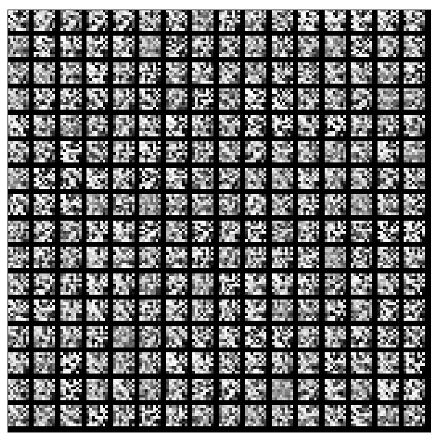

- 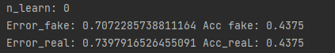

- 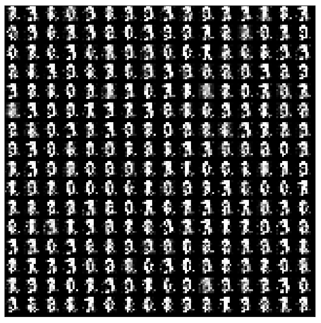

- 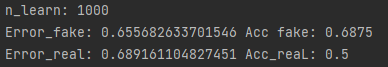

- 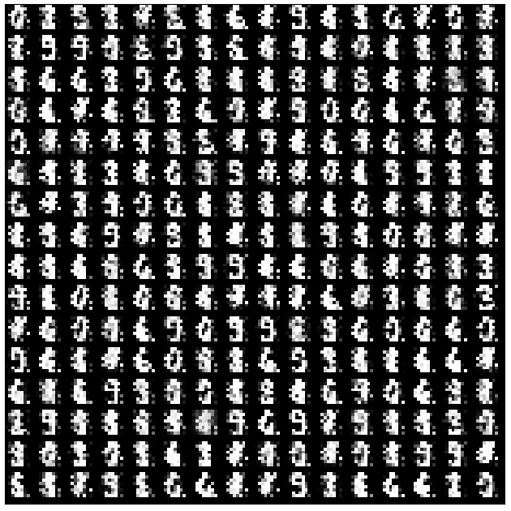

- 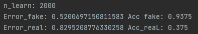

- 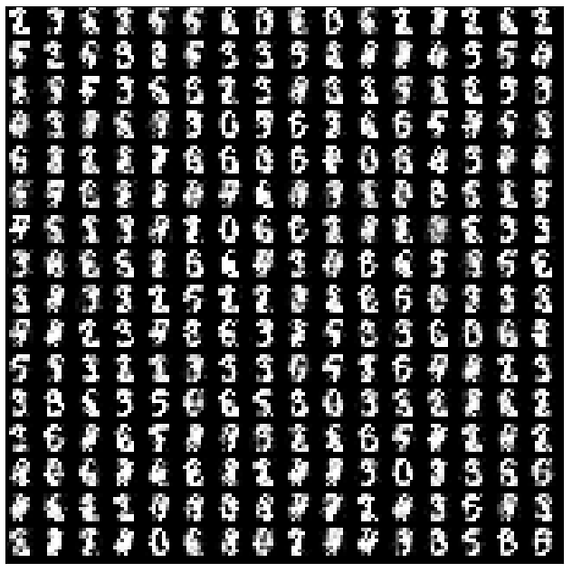

- 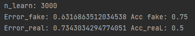

- 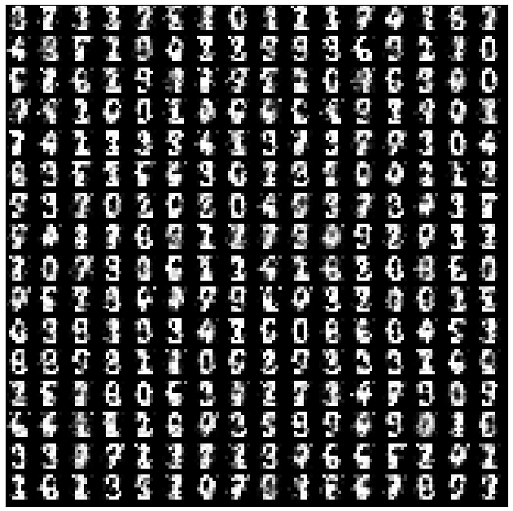

- 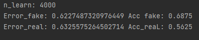

- 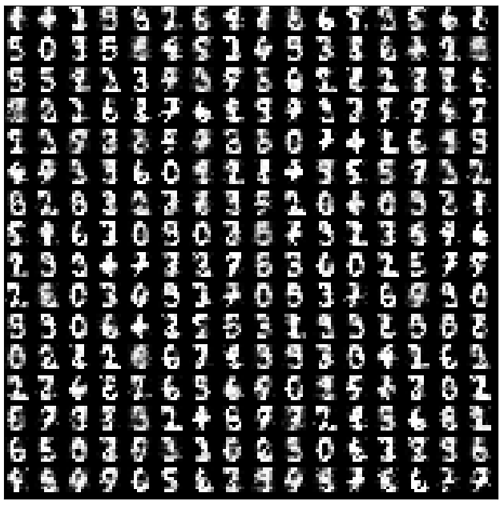

- 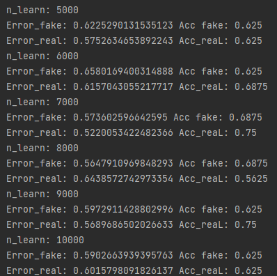

### 8.4.6 오차와 정확도 추이

- 오차는 처음에 큰 변화 있지만 학습 횟수가 늘수록 거의 변하지 않음. 생성자는 가짜 이미지 입력 시의 오차 높이려고 하고 식별자는 오차를 낮추려고 하는 과정에서 균형을 맞춤
- 생성자는 원본 이미지와 가짜 이미지를 구분하기 위해 어렵게 학습, 원본 이미지 입력 시의 오차도 높이려고 함
- 식별자도 오차를 낮추려고 해서 이 과정에서 균형 맞춤
- 정확도는 생성자가 완벽하게 동작하면 0.5, 식별자가 완벽하게 동작하면 1.0이 됨

## 8.5 GAN에서 파생되는 기술

### 8.5.1 조건부 GAN

- GAN은 무작위로 샘플링 -> 생성되는 데이터 종류 설정 어려움
- 조건부 GAN은 학습 시 레이블 설정해 특정한 종류를 설정한 데이터 생성 가능

### 8.5.2 pix2pix

- 특정 언어를 다른 언어로 번역하는 것처럼 이미지에 있는 특성을 다른 특성으로 바꿈
- pix2pix는 쌍으로 구성된 이미지에서 이미지 사이의 관계를 학습함

### 8.5.3 Cycle GAN

- 개별 이미지를 쌍으로 묶어 사용하지 않고 여러 이미지를 모은 그룹을 쌍으로 묶어 학습하는 특징이 있음 
- 이미지 그룹 A의 이미지들 => 이미지 그룹 B의 이미지들 => 이미지 그룹 A의 이미지들
  - 이런 식으로 학습시킴
