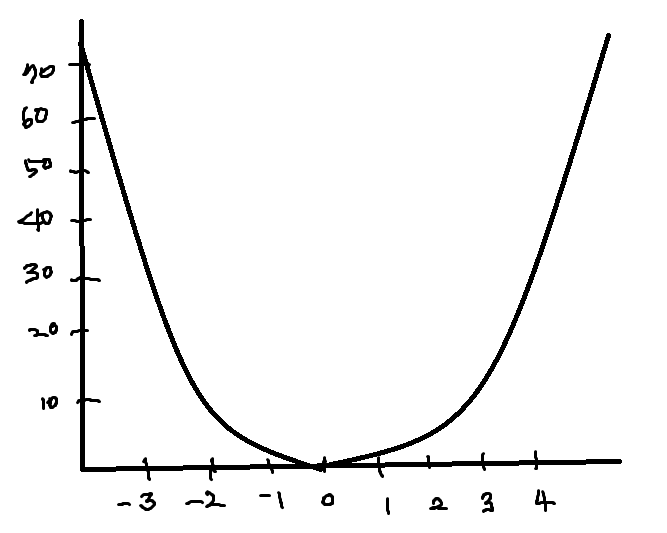
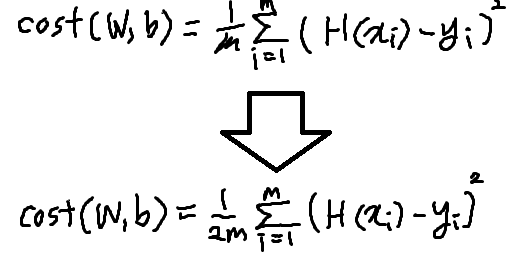
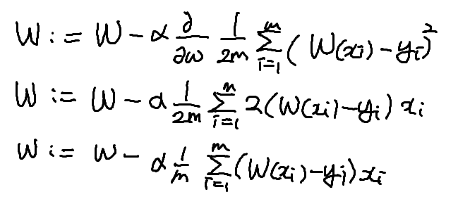

# 03. How to minimize cost

## Simplified hypothesis

**Hypothesis** H(x) = Wx

**Cost**              


## What cost(W) looks like?

- | x    | y    |
  | ---- | ---- |
  | 1    | 1    |
  | 2    | 2    |
  | 3    | 3    |

  - W=0, Cost(W)=4.67

    

  - W=1, Cost(W)=0

    

  - W=2, Cost(W)=4.67

    

  - W=3, Cost(W)=18.67

     

## How to minimize cost?




## Gradient descent algorithm

- 컴퓨터가 최저점을 찾을 수 있게 하는 널리 쓰이는 알고리즘
- gradient: 경사, descent: 하강
- 경사하강 알고리즘
- 경사를 따라 내려가면서 최저점을 찾게 하는 것
- 엔지니어링 = 최적점 찾는 것, 손실 최소로 하는 것
- 변수가 여러 개일 때도 사용 가능한 좋은 알고리즘
- gradient는 접선의 기울기(즉 미분값 )
- 경사가 급할수록 더 빨리 곡선의 아래쪽으로 내려감

### How it works?

- 최초 추정값으로 시작
  - 0,0으로 시작(또는 다른 값)
  - cost가 조금씩 줄어들도록 W, b값을 지속적으로 바꾼다. 

- 기울기값 구해서 cost 최소화되도록 업데이트
- 최소점에 도달했다고 판단될 때까지 이 과정을 반복

## Formal definition



- 미분 후 약분의 간편화를 위해서 분모에 2를 곱함
- 알파값: learning rate, 기울기를 얼만큼 W에서 뺄 지 반영하는 배수 역할, 알파값은 주로 굉장히 작은 값을 사용함, 크면 클수록 빨리 움직임 



## Convex function

- 어느 경우에는 전체 경우의 최솟값을 찾을 수 없을 수도 있음
- 미분 시 기울기가 0인 지점들이 여러 개 있는 경우가 그러하다
  - local minimum이 여러 개인 경우
  - gradient descent 이런 경우 사용 불가
- 우리의 cost함수가 convex function 이면 국소값이 곧 최솟값이므로 gradient descent를 마음껏 사용해도 됨

## Cost function in pure Python


 ```python
 import numpy as np
 
 X = np.array([1,2,3])
 Y = np.array([1,2,3])
 
 def cost_func(W, X, Y):
 	c = 0
     for i in range(len(X))
     	c += (W * X[i] - Y[i]) ** 2
     return c / len(X) # 편차제곱의 평균
 
 for feed_W in np.linspace(-3, 5, num=15): #-3부터 5까지 15개의 구간으로 나눈다
     curr_cost = cost_func(feed_W, X, Y)
     print("{:6.3f} | {:10.5f}".format(feed_W, curr_cost))
 ```

## Cost function in TensorFlow

```python
X = np.array([1, 2, 3])
Y = np.array([1, 2, 3])

def cost_func(W, X, Y):
    hypothesis = X * W
    return tf.reduce_mean(tf.square(hypothesis - Y))

W_values = np.linspace(-3, 5, num=15)
cost_values = []

for feed_W in W_values:
    curr_cost = cost_func(feed_W, X, Y)
    cost_values.append(curr_cost)
    print("{:6.3f} | {:10.5f}".format(feed_W curr_cost))
```

## Gradient descent(feat. tensorflow)

```python
alpha = 0.01
gradient = tf.reduce_mean(tf.multiply(tf.multiply(W, X) - Y), X)
descent = W - tf.multiply(alpha, gradient)
W.assign(descent)
```


 ```python
 tf.set_random_seed(0)
 
 x_data = [1., 2., 3., 4.]
 y_data = [1., 3., 5., 7.]
 
 W = tf.Variable(tf.random_normal([1], -100., -100.))
 # 1개짜리 변수 만들어서 W에 할당해서 정의(정규분포 통함)
 # W = tf.Variable([5.0]) 이더라도 똑같다. W의 초기값이 무엇이든 W의 특정값에서 cost는 0이 된다.
 
 
 for step in range(300):
     hypothesis = W * X
     cost = tf.reduce_mean(tf.square(hypothesis - Y))
     
     alpha = 0.01
     gradient = tf.reduce_mean(tf.multiply(tf.multiply(W, X) - Y), X)
     descent = W - tf.multiply(alpha, gradient)
     W.assign(descent)
     
     if step % 10 == 0:
         print('{:5} | {:10.4f} | {:10.6f}'.format(step, cost.numpy(), W.numpy()[0]))
 ```
