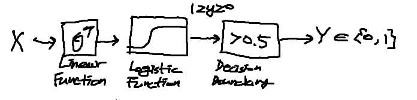
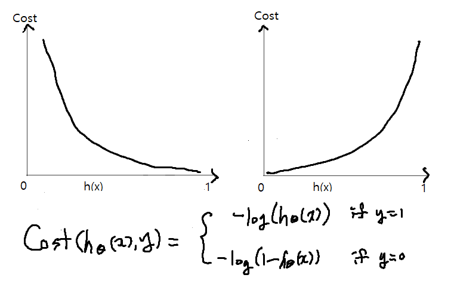

# 05. Logistic Regression

- 분류 기법 중 하나임
- 도형 분류에 많이 사용되는 알고리즘
- 모델이 만들어지는 원리 이해가 중요

## 목차

- What is Logistic Regression?
  - Classification
  - Logistic vs Linear
- How to solve?
  - Hypothesis Representation
  - Sigmoid/Logistic Function
  - Decision Boundary
  - Cost Function
  - Optimizer (Gradient Descent)
- Codes(Eager Execution)
- Summary

## Classification

- 어떤 게 Binary(Multi-class) Classification?
  - 변수가 0이거나 1이다(0: positive / 1:negative)
- 시험: Pass or Fail
- 스팸:스팸이 아니다(정상) 또는 스팸
- 얼굴: 진짜 또는 사기
- Tumor

 머신러닝 하기 위해서는 0,1 Binary Classficiation 위한 두 가지 값으로 나뉘어야 함

```python
x_train = [[1, 2], [2, 3], [3, 1], [4, 3], [5, 3], [6, 4]]
y_train = [[0], [0], [0], [1], [1], [1]]
```

이런 것들을 통해 Logistic Regression 만들 수 있음

## Logistic vs Linear

- Logistic
  - 
  - 두 가지의 케이스를 구분선으로 구분 가능
  - 셀 수 있고 데이터가 흩어져 있음
  - ex) 신발 사이즈 등 (데이터가 구분이 됨)
- Linear
  - 
  - 데이터가 연속적임
  - 이어지는 데이터를 예측 가능함
  - ex) 시간, 몸무게, 키(연속적인 데이터)

```python
Logistic_Y = [[0], [0], [0], [1], [1], [1]] # One Hot
Linear_Y = [828.659973, 833.450012, 819.23999, 828.349976, 831.659973] # Numeric
```

### Hypothesis Representation

- 공부 많이 할 수록 합격률 높아짐
  - 
  - Linear Regression 적용 경우 h(x) = WX
  - 그러나 연속적인 값이 아니라 0과 1로 구분해야 하므로 새로운 함수가 필요함

### Signmoid (Logistic) function

- g(z) function out value is between 0 and 1
- 

- 

- z가 무한대에 가까울수록 함숫값이 1에 가까워지고, z가 마이너스 무한대에 가까울수록 함숫값이 0에 가까워진다. 

- ```python 
  [Tensorflow Code]
  hypothesis = tf.sigmoid(z)
  hypothesis = tf.div(1., 1 + tf.exp(z))
  ```

## Decision Boundary

**Linear / Non-linear decision boundary**


```python
[Tensorflow Code]
predicted = tf.cast(hypothesis > 0.5, dtype=tf.int32)
```

## Cost Function

최적의 파라미터로 만드는 게 cost function


- 차이가 발생.. 차이 줄임으로서 최적의 모델을 찾는다

- h(x) = y이면 Cost = 0

- ```python
  [Tensorflow Code]
  def loss_fn(hypothesis, labels):
      cost = tf.reduce_mean(labels * tf.log(hypothesis)+(1-labels)*tf.log(1-hypothesis))
      return cost
  ```

## Cost Function

**A convex logistic regression cost function**

- convex 함수처럼 볼록해야 최적의 값을 구할 수 있는데 보통 아래의 그래프처럼 나오게 된다.
- 

- 

- cost(h(x), y) = -ylog(h(x))-(1-y)log(1-h(x))
  - 두 함수를 합쳐서 포물선 형태의 함수 만듬(convex 형태)

```python
[Tensorflow Code]
cost = -tf.reduce_mean(labels * tf.log(hypothesis) - (1-labels) * tf.log(1-hypothesis))
# 차원축소
```

## Optimization

- 경사값이 0인 경우를 찾으려고 함

- 

- cost(h(x), y) = -ylog(h(x))-(1-y)log(1-h(x))

- 

- ```python
  [Tensorflow Code]
  def grad(hypothesis, labels):
      with tf.GradientTape() as tape: #가설과 실제값의 차이
          `loss_value = loss_fn(hypothesis, labels)
      return tape.gradient(loss_value, [W, b]) #값이 바뀌게 됨
  optimizer = tf.train.GradientDescentOptimizer(learning_rate = 0.01)
  optimizer.apply.gradients(grads_and_vars=zip(grads, [W, b]) # 선언한 함수와 ([W, b]는 모델값) 통해 최적값 구함
  ```

### Code(Eager)

```python
import tensorflow.contrib.eager as tfe
tf.enable_eager_execution()
dataset = tf.data.Dataset.from_tensor_slices((x_train, y_train)).batch(len(x_train))
W = tf.Variable(tf.zeros([2,1]), name='weight')
b = tf.Variable(tf.zeros([1]), name='bias')

def logistic_regression(features):
    hypothesis = tf.div(1., 1. + tf.exp(tf.matmul(features, W) + b))
    return hypothesis
def loss_fn(features, labels):
    hypothesis = logistic_regression(features)
    cost = -tf.reduce_mean(labels * tf.log(loss_fn(hypothesis) + (1 - labels) * tf.log(1 - hypothesis))
    return cost
def grad(hypothesis, features, labels):
    with tf.GradientTape() as tape:
        loss_value = loss_fn(hypothesis, labels)
    return tape.gradient(loss_value, [W, b])
optimizer = tf.train.GradientDescentOptimizer(learning_rate = 0.01)
                           
for step in range(EPOCHS):
  for features, labels in tfe.Iterator(dataset):
      grads = grad(logistic_regression(features), features, labels)
      optimizer.apply_gradients(grads_and_vars=zip(grads, [W, b]))
      if step % 100 == 0:
           print("Iter: {}, Loss: {: .4f}".format(step, loss_fn(logistic_regression(features), labels)))
                           
                           
def accuracy_fn(hypothesis, labels):
   predicted = tf.cast(hypothesis > 0.5, dtype=tf.float32)
   accuracy = tf.reduce_mean(tf.cast(tf.equal(predicted, labels), dtype = tf.int32))
   return accuracy
                           
test_acc = accuracy_fn(logistic_regression(x_test), y_test)
```
