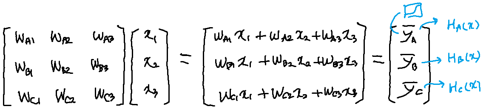
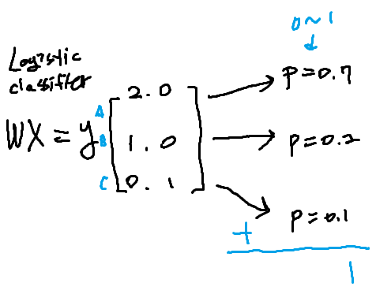
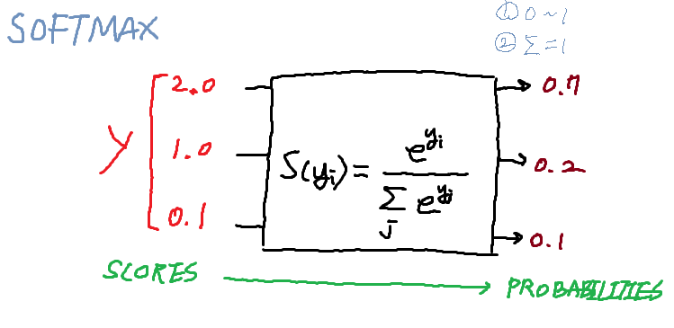
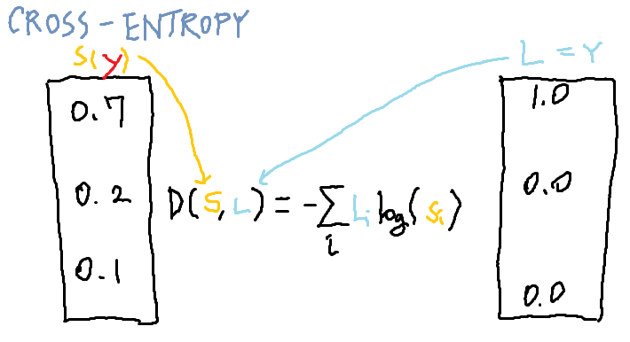
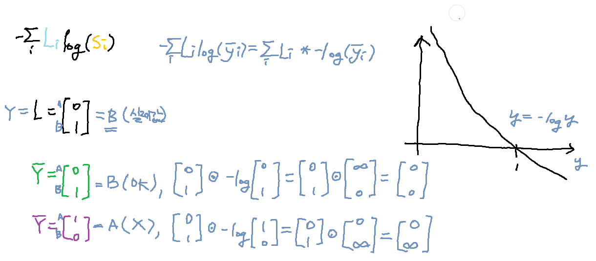
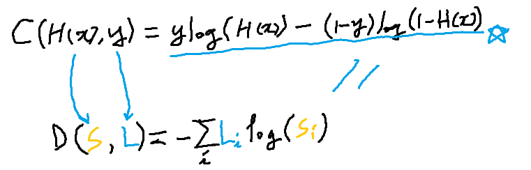
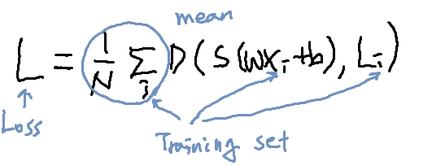

# 6-2. Softmax classifier의 cost 함수

## Where is sigmoid?

- 2.0, 1.0, 0.1의 값을 다 0~1의 값으로 만들고 합산 시 1이 되게 함(확률처럼)
- 그런 함수를 Softmax라고 함
- 

- 

- 최댓값 골라서 1로 만들고 나머지는 0으로 만드는 Hot Encoding을 함

## Cost Function

- 

- 

- 예측이 틀릴 때 cost가 엄청 크고 정확하면 cost가 0

## Logistic cost VS cross entropy

- 
- 

## Descent

