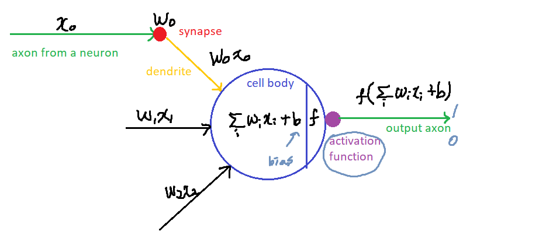
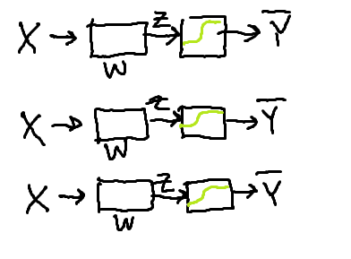
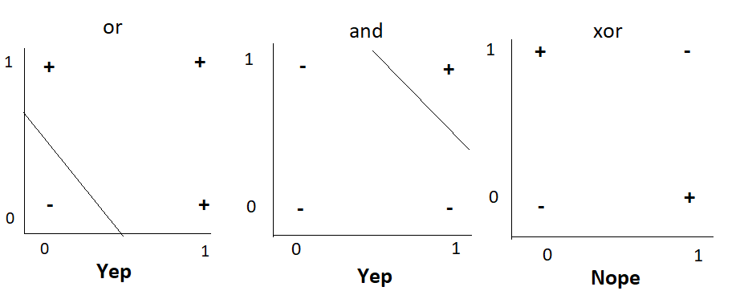

# 08-1. 딥러닝의 기본 개념: 시작과 XOR 문제

## Ultimate dream: thinking machine

- 인류의 궁극적 꿈: 우리를 대신해서 골치아픈 문제를 생각할 수 있는 기계를 만들자

  - 시작: 우리의 뇌를 처음에 공부하기 시작했던 시점

    - 뇌가 복잡하게 연결되어 있다.
    - 자세하게 봤더니 뉴런이라고 불리는 유닛이 너무 단순하게 동작이 된다
    - 어떤 input이 있고 그것을 전해주는 길이에 따라 신호의 양이 달라짐
    - x*w의 sum 이 일어나고 통과되면서 bias가 더해지면서 그 다음으로 전달이 됨, 그런 값들이 어떤 특정 값 이상이면 활성화, 이하면 비활성화

    - 이런 형태의 뉴런은 우리도 수학적으로 만들 수 있겠다. => Activation Functions

## Activation Functions

## Logistic regression units

- input layer&output layer

### Hardware implementations

- Frank rosenblatt: x가 실제로 연결되는 선의 형태로 만듦
- 등등
- 기계가 특정 인풋에 대해 출력을 냄

### False Promises

- 허황된 약속들을 하기 시작함
- Dr.Frank
  - "스스로 학습해서 걸을 수 있고 말을 할 수 있고 심지어는 글도 쓰고 스스로 만들어내고 자기의 존재를 인식하게 된다."

## AND/OR problem: linearly seperable?

- 그 당시에는 AND/OR 로직 풀 수 있으면 생각하는 기계 만들 수 있다고 생각했었음
- 기계가 이것들을 예측가능하게 하는 것이 중요한 문제였다.
- linear한 모델이었으므로 OR, AND일 때 가능하다
- 사람들이 박수를 치기 시작
- 찬물을 끼얹은 것이 XOR였다.

### XOR problem: linearly seperable?

- XOR: 값이 같을 때는 0, 다를 때는 1

- XOR이 linear하게 선을 어떻게 그어도 100% 맞게(구분) 나올 수가 없다.

- 

- | x1   | x2   |      |
  | ---- | ---- | ---- |
  | 0    | 0    | 0    |
  | 0    | 1    | 1    |
  | 1    | 0    | 1    |
  | 1    | 1    | 0    |

- 많은 사람들이 XOR 풀고자 도전

## Perceptrons

- Minsky 교수가 69년도에 책을 냄
  - XOR은 아니다. 지금 가지고 있는 걸로는 못 푼다고 증명
  - 한 개로는 못 하고 여러 개를 합치면(MLP=multilayer neural nets) 할 수 있어. 그런데 큰 문제가 각각에 들어있는 w, b를 학습 못 시켜.
  - 그래서 많은 사람들이 실망...
- "No one on earth had found a visible way to train"<- 요런 이야기를 함

- 많은 사람들이 이 말을 믿게 되었다... 시간은 계속 흐르고...
- 86년도에 이 문제가 해결, 그러나 74년도에도 해결되었었다.
  - 네트워크 연결되어있고 w, b 통해 입력 가지고 출력 만들 수 있음
  - 예상한 출력과 다를 경우 w,b 조절해야 함
  - Backpropagation 방법 개발되었다.
  - 에러 만들어서 뒤로 다시 돌리면 어떨까? 하는 아이디어
  - 폴의 박사논문 -> 그러나.. 아무도 관심이 없었다.
  - 70년도 후반에 Minsky 교수를 폴이 만듬
  - 그러나 minsky도 관심이 없었드..
  - 버리기가 아까우니까 82년도에 논문을 발표한 Paul
  - 86년도에  **Hinton**이 똑같은 방법을 독자적으로 만듬(재발견)
  - XOR도 되고 복잡한 형태의 예측이 가능해짐

## Convolutional Neural Networks

- 다쿤이라는 교수는 다른 방법으로 이 문제 접근
- 고양이를 가지고 그림을 보게 한 후, 시신경 뉴런이 어떻게 동작하는지 관찰
- 그림의 형태에 따라 일부의 뉴런들만 활성화, 다른 그림 주면 다른 뉴런들이 활성화된 것을 발견
- 그림 볼 때 우리의 신경망 세포가 동시에 전체 보는 게 아니라 일부 담당한 신경망이 있고 조합되는 게 아닐까 하는 것이 이 다쿤의 생각
- 그래서 개발한 것이 convolutional neural networks
- 그림을 잘라서 부분 부분을 레이어로 다 보내서 나중에 합치는 것
- 90%이상의 성능을 보임(글자 인식)
- 90년도 후반에는 10~20% 의 책들이 이런 기계 통해 읽혔음

- 자율주행자동차가 나와서 성공도 했었음.

## A Big problem

- 사람들에게 붐을 일으키다가 큰 문제에 봉착
- Backpropagation이 몇 개 정도의 레이어에서는 잘 작동하지만 복잡한 문제 풀 때는 10여개 정도의 레이어 처리해야 함. 그러나 10개 정도되었을 때 에러 역전파하면 거의 에러 전달 안 되고 학습도 안 된다. 
- 많이 할 수록 성능이 떨어진다. 
- 다른 형태의 알고리즘들이 나오기 시작했음
- 95년도에 다쿤 교수가 한 말 : 단순한 알고리즘인 SVN, RandomForest가 더 잘 되는 것 같다. 
- 침체기에 들어간 neural network
