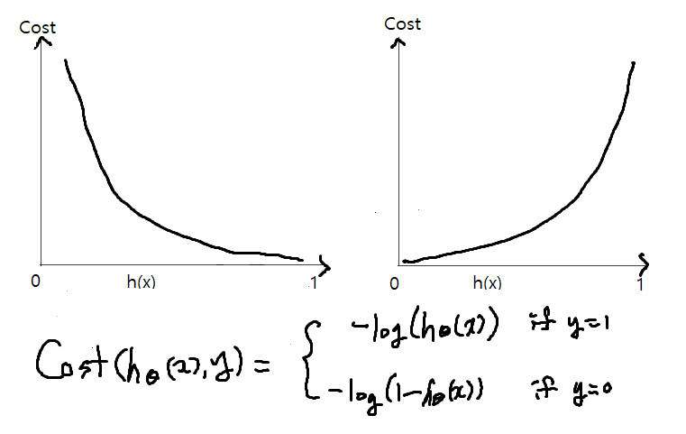
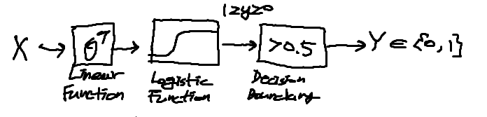

# [TensorFlow] Lab-09-1 neural nets XOR

- XOR Problem
  - Logistic Regression (Recap)
  - Neural Network
  - Chart
  - Codes (Eager Execution)
  - Summary

## Logistic Regression(Recap)

- 
- 

- 

### XOR


- 

- 값 구분 위해 Logistic Regression으로 어렵다
- 앞 강의 내용처럼 Logistic Regression 3개를 합쳐서 생각해본다

## Neural Net

### 2 layer

- 3개의 로지스틱 리그레션 통해 XOR 문제 해결 가능
- 두 단의 레이어가 쌓인다. => 2 layer neural net

- ```python
  # [Tensorflow Code]
  def neural_net(features):
      layer1 = tf.sigmoid(tf.matmul(features, W1) + b1) # W1=[2,1], b1=[1]
      layer2 = tf.sigmoid(tf.matmul(features, W2) + b2) # W2=[2,1], b2=[1]
      hypothesis = tf.sigmoid(tf.matmul(tf.concat([layer1, layer2], -1), W3) + b3) # W3=[2,1], b3=[1]
      return hypothesis
  ```

### Vector

- 2개의 Logistic Regression 합쳐서 하나의 컴포넌트로 만드는 것이 가능 => 2 layer neural net

- ```python
  # [Tensorflow Code]
  def neural_net(features):
      layer = tf.sigmoid(tf.matmul(features, W1) + b1)
      hypothesis = tf.sigmoid(tf.matmul(layer, W2) + b2)
      return hypothesis
  ```

### Code(Eager)

```python
import numpy as np
import matplotlib.pyplot as plt
%matplotlib inline
import tensorflow as tf
import tensorflow.contrib.eager as tfe

tf.enable_eager_execution()
tf.set_random_seed(777) # for reproducibility

print(tf.__version__)

# 실제 테스트할 데이터(XOR 관련)
x_data = [[0, 0],
          [0, 1],
          [1, 0],
          [1, 1]]
y_data = [[0],
         [1],
         [1],
         [0]]

dataset = tf.data.Dataset.from_tensor_slices((x_data, y_data)).batch(len(x_data))

def preprocess_data(features, labels):
    features = tf.cast(features, tf.float32)
    labels = tf.cast(labels, tf.float32)
    return features, labels

W1 = tf.Variable(tf.random_normal([2,1]), name='weight1')
b1 = tf.Variable(tf.random_normal([1]), name='bias1')

W2 = tf.Variable(tf.random_normal([2, 1]), name='weight2')
b2 = tf.Vairable(tf.random_normal([1]), name='bias2')

W3 = tf.Variable(tf.random_normal([2, 1]), name='weight3')
b3 = tf.Variable(tf.random_normal([1]), name='bias3')

def neural_net(features):
    layer1 = tf.sigmoid(tf.matmul(features, W1) + b1)
    layer2 = tf.sigmoid(tf.matmul(features, W2) + b2)
    layer3 = tf.concat([layer1, layer2], -1)
    layer3 = tf.reshape(layer3, shape=[-1, 2])
    hypothesis = tf.sigmoid(tf.matmul(layer3, W3) + b3)
    return hypothesis

def loss_fn(hypothesis, labels):
    cost = -tf.reduce_mean(labels * tf.log(hypothesis) + (1-labels) * tf.log(1-hypothesis))
    return cost

optimizer = tf.train.GradientDescentOptimizer(learning_rate=0.01)

def accuracy_fn(hypothesis, labels):
    predicted = tf.cast(hypothesis > 0.5, dtype=tf.float32)
    accuracy = tf.reduce_mean(tf.cast(tf.equal(predicted, labels), dtype=tf.float32))
    return accuracy

def grad(features, labels):
    with tf.GradientTape() as tape:
        loss_value = loss_fn(neural_net(features), features, labels)
    return tape.gradient(loss_value, [W1, W2, W3, b1, b2, b3])

EPOCHS = 50000
for step in range(EPOCHS):
    for features, labels in tfe.Iterator(dataset):
        features, labels = preprocess_data(features, labels)
        grads = grad(neural_net(features), labels)
        optimizer.apply_gradients(grads_and_vars=zip(grads, [W1,W2,W3,b1,b2,b3]))
        if step % 5000 == 0:
            print("Iter: {}, Loss: {:.4f}".format(step, loss_fn(neural_net(features), labels)))
x_data, y_data = preprocess_data(x_data, y_data)
test_acc = accuracy_fn(neural_net(x_data), y_data)
print("Testset Accuracy: {:.4f}".format(test_acc))
       
```

- 여러 개의 인공신경망 쌓아서 작업 처리

