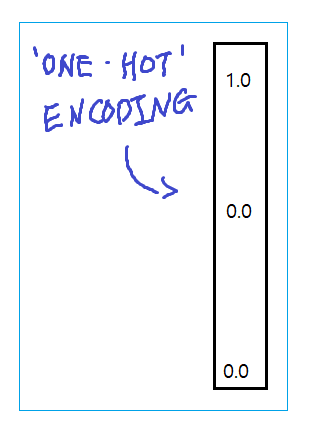
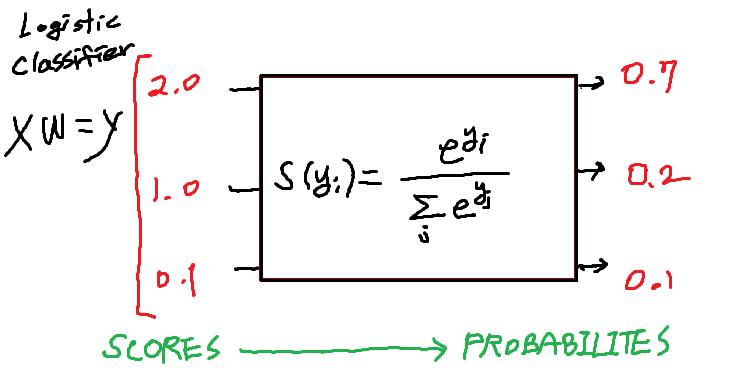

# [TensorFlow] Lab-06-1 Softmax Classifier

## 목차

- Sample Dataset

- Softmax function
- Cost function
- Gradient Function
- Train & Result
- What's Next

## Sample Dataset

```python
x_data = [[1, 2, 1, 1],
          [2, 1, 3, 2],
          [3, 1, 3, 4],
          [4, 1, 5, 5],
          [1, 7, 5, 5],
          [1, 2, 5, 6],
          [1, 6, 6, 6],
          [1, 7, 7, 7]]
y_data = [[0, 0, 1],
          [0, 0, 1],
          [0, 0, 1],
          [0, 1, 0],
          [0, 1, 0],
          [0, 1, 0],
          [1, 0, 0],
          [1, 0, 0]]

#convert into numpy and float format
#학습시키기 위해 만듬
x_data = np.asarray(x_data, dtype = np.float32)
y_data = np.asarray(y_data, dtpye = np.float32)

nb_classes = 3 #num classes
```



## Softmax function



```python
tf.matmul(X, W) + b
```

```python
hypothesis = tf.nn.softmax(tf.matmul(X, W) + b)
```

```python
#Weight and bias setting
W = tfe.Variable(tf.random_normal([4, nb_classes]), name='weight')
b = tfe.Variable(tf.random_normal([nb_classes]), name='bias')
variables = [W, b]

<tf.Variable 'weight:0' shape=(4, 3) dtype = float32, numpy=
array([[ 2.0265348, -0.19990598, 0.187595  ],
       [-1.8624718,  1.1830902, -0.75108314],
       [ 0.7819291,  0.19707595, 0.664097  ],
       [ 1.5643852, -0.04990807,-0.38255563]], dtype=float32)>
<tf.Variable 'bias:0' shape=(3,) dtype=float32, numpy=array([-1.4564867, 0.53983474, -1.1366715], dtype=float32)

```


```python
hypothesis = tf.nn.softmax(tf.matmul(x_data, W) + b)

# Softmax onehot test
sample_db = [[8, 2, 1, 4]]
sample_db = np.asarray(sample_db, dtype=np.float32)

# Output
tf.Tensor([[0.9302204   0.06200533   0.00777428]], shape=(1, 3), dtype=float32)
```

- 첫번째 값이 가장 큰 값이므로 이 값이고 총합은 1

## Cost function: cross entropy

```python
# Cross entropy cost/loss
cost = tf.reduce_mean(-tf.reduce_sum(Y * tf.log(hypothesis), axis = 1))

optimizer = tf.train.GradientDescentOptimizer(learning_rate = 0.1).minimize(cost)
```

- Cost 함수

```python
def cost_fn(X, Y):
    logits = hypothesis(X)
    cost = -tf.reduce_sum(Y * tf.log(logits), axis = 1)
    cost_mean = tf.reduce_mean(cost)
    return cost_mean

print(cost_fn(x_data, y_data))
```

## Gradient Function

```python
def grad_fn(X, Y):
    with tf.GradientTape() as tape:
        cost = cost_fn(X, Y)
        grads = tape.gradient(cost, variables)
        return grads
    
print(grad_fn(x_data, y_data))
```

## Train

```python
def fit(X, Y, epochs=2000, verbose=100)
	optimizer = tf.train.GradientDescentOptimizer(learning_rate=0.1)
    for i in range(epochs):
        grads = grad_fn(X, Y)
        optimzier.apply_gradients(zip(grads, variables))
        if (i==0) | ((i+1)%verbose==0):
            print('Loss at epoch %d: %f' %(i+1, cost_fn(X, Y).numpy()))
```

## Prediction

```python
a = hypothesis(x_data)

print(a)
print(tf.argmax(a,1))
print(tf.argmax(y_data, 1))
```

