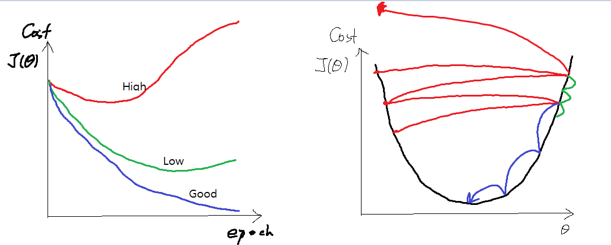

# [TensorFlow] Lab-07-1 application and tips

- 어떤 팁과 응용방법 통해 현실 문제 해결 가능한가?

## 목차

- Learning rate
  - Gradient
  - Good and Bad Learning rate
  - Annealing the learning rate(Decay)
- Data preprocessing
  - Standardization / Normanalization
  - Noisy Data
- Overfitting
  - Regularization
  - L2 Norm

## Learning rate

- Gradient(기울기)와의 조합 통해 진행

- learning rate를 어떻게 컨트롤하냐? -> gradient에 영향을 줌

- learning rate 과 gradient통해 최적값 접근

-  ```python
   def grad(hypothesis, labels):
       with tf.GradientTape() as tape:
           loss_value = loss_fn(hypothesis, labels)
       return tape.gradient(loss_value, [W, b])
   optimizer = tf.train.GradientDescentOptimizer(learning_rate=0.01)
   optimizer.apply_gradients(grads_and_vars=zip(grads,[W, b]))
   ```

### Good and Bad

- learning rate 어떻게 설정하느냐에 따라서 cost값이 다르다
- 적절히 설정해서 빨리 최적값을 찾는 것이 중요함
- 주로 0.01이나 0.0003(=3e-4)을 learning_rate로 설정
- 

### Annealing the learning rate

- 어느 순간 학습이 되지 않는 경우가 있는데 learning rate 조절하면 cost가 떨어질 수 있음
-  -> learning rate decay 기법이라고 함
-  

```python
learning_rate = tf..exponential_decay(starter_learning_rate, global_step, 1000, 0.96, staircase)
# tf.train.exponential_decay / tf.train.inverse_time_decay
# tf.train.polynomial_decay

def exponential_decay(epoch):
    starter_rate=0.01
    k=0.96
    exp_rate = starter_rate * exp(-k*t)
    return exp_rate
```

## Data preprocessing(데이터 전처리)

**Feature Scaling**

- 표준화 기법(평균에서 얼만큼 떨어졌느냐)
  - x_new = (x-평균)/표준편차

```python
Standardization = (data - np.mean(data)) / sqrt(np.sum(data - np.mean(data))^2) / np.count(data))
```

- 정규화 기법(0~1)
  - x_new = (x - x_min) / (x_max - x_min)

```python
Normalization = (data - np.min(data, 0)) / (np.max(data, 0) = np.min(data, 0))
```

**Noisy Data**

- 쓸모없는 데이터를 없애는 것이 가장 중요함
- 머신러닝 모델 만들기 위한 깔끔한 데이터 만들기 위해 전처리를 함
- Will you order a pizza..? => NLP => You order pizza
  - 학습에 유용한 데이터를 만든다
