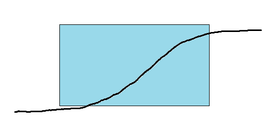
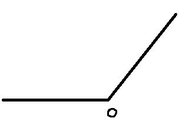

# [TensorFlow] Lab10-1 Relu

## Relu activation function

- Problem of Sigmoid
- Why Relu?
- Code
  - load dataset
  - create network
  - define loss function
  - experiments
    - parameters
    - model
    - eager mode
- What's Next

### Problem of Sigmoid

Input --> Network --> output

​										ground-truth - output = loss

​										d(loss) = gradient

<================================Backpropagation



- 사각형 부근의 그래프 접선의 기울기는 0보다 매우 큼
- 극단 좌표계쪽은 0에 접선의 기울기가 가깝다
- gradient 전달 받아서 학습하는데 gradient가 매우 작으면 안 됨
- 만약 network가 딥하면 ... 시그모이드가 여러 개 있을 거고 곱해질 때 gradient가 9에 가까워서 전달받을 gradient가 없어질 수 있음(**Vanishing Gradient**)
- 이게 바로 Sigmoid의 문제점

### Why Relu?

- f(x) = max(0, x)
  - x가 0보다 큰 양수값을 가지면 x를 추출해서 output으로 만들어라
  - x가 0보다 작은 값을 가지면 그대로 0을 추출해서 output으로 만들어라

- 
  - 0보다 클 때는 gradient가 1
  - gradient가 잘 전달이 됨
  - 그러나 0보다 작은 음수의 값일 때, gradient가 0(아예 전달이 안 됨, 이건 문제점)
  - 그래도 이걸 사용하는 이유는 성능이 좋기 때문임
  - tf.keras.activations ---------> sigmoid, tanh, relu, elu, selu
  - 문제점 해결 위해 leaky relu 사용하기도 하는데 keras의 layers쪽에 있다.
    - tf.keras.layers -----------> leaky relu
  - leaky relu: 0보다 작은 음수 값 가질 때 0.01 과 값 곱해서 역전파하는 방식임

## Code

### Load mnist(데이터셋)

```python
import tensorflow as tf
import numpy as np
from tensorflow.keras.utils import to categorical
from tensorflow.keras.datasets import mnist # fashion_mnist, cifar10, cifar100
tf.enable_eager_execution() # tensorflow 2.0 부터는 eager 모드 강권 -> eager 모드로 실행, eager 모드로 실행하려면 반드시 작성해야 함

# mnist를 load하는 함수
def load_mnist() :
    (train_data, train_labels), (test_data, test_labels) = mnist.load_data()
    # numpy의 expand_dims 통해 채널을 하나 추가, shape을 바꿈
    # [batch_size, height, width, channel] 이런 식으로 갖춰져 있어야 하므로
    # -1의 의미: channel을 끝에 만들 것이다.
    train_data = np.expand_dims(train_data, axis=-1) # [N, 28, 28] -> [N, 28, 28, 1]
    test_data = np.expand_dims(test_data, axis=-1) # [N, 28, 28] -> [N, 28, 28, 1]
    
    train_data, test_data = normalize(train_data, test_data) # [0~255] -> [0~1], 이미지 숫자값들을 0~1로 normalization을 함
    
    # One hot incoding(이미지가 7인 게 있으면 categorical로 해서 000000100 이라고 적어주는 것)
    train_labels = to_categorical(train_labels, 10) #[N,] -> [N, 10]
	test_labels = to_categorical(test_labels, 10) #[N,] -> [N, 10]    
    
    return train_data, train_labels, test_data, test_labels

  def normalize(train_data, test_data):
      train_data = train_data.astype(np.float32) / 255.0
      test_data = test_data.astype(np.float32) / 255.0
        
      return train_data, test_data
```

## Create network

- 어떤 함수를 이용할 것인지 생각해야 함

- flatten 함수 필요: shape를 펼쳐주는 역할

  - ```python
    def flatten():
        return tf.keras.layers.Flatten()
    ```

- dense layer:

  - ```python
    def dense(channel, weight_init):
        return tf.keras.layers.Dense(units=channel, use_bias=True, kernel_initializer=weight_init)
    ```

  - unit: output으로 나가는 채널을 몇 개로 설정할 지에 대한 의미

  - bias: true이면 i

- relu activation:

  - ```python
    def relu() :
        return tf.keras.layers.Activation(tf.keras.activations.relu)
    ```

- 모델 만들기

  - ```python 
    class create_model(tf.keras.Model):
        def __init__(self, label_dim):
            super(create_model, self).__init__()
            # label_dim: logit 구할 때 최종 몇 개 output 낼 건지 네트워크 알려줘야 하니까 받기 위해서 이렇게 명시해줌
            
            weight_init = tf.keras.initializers.RandomNormal()
            # 평균이 0, 분산이 1
            self.model = tf.keras.Sequential()
            # List 자료구조 타입
            
            self.model.add(flatten()) # [N, 28, 28, 1] -> [N, 784]
            
            for i in range(2):
                # [N, 784] -> [N, 256] -> [N, 256]
                self.model.add(dense(256, weight_init))
                self.model.add(relu())
                
            self.model.add(dense(label_dim, weight_init)) # [N, 256] -> [N, 10]
            
       def call(self, x, training=None, mask=None):
           x = self.model(x)
            
           return x
    ```

  - 클래스가 너무 어렵다 싶으면 다르게 짜도 된다.

### Define loss

- ```python
  # 모델과 이미지, 라벨 받고 모델 이미지 넣어서 숫자가 무너지에 대한 logit값 추출
  # loss 구함
  #  0   0   0   0   0   0   0   1   0   0   label
  # 0.1 0.1 0.0 0.2 0.0 0.0 0.0 0.6 0.0 0.0  softmax(logit)
  def loss_fn(model, images, labels):
      logits = model(images, training = True)
      loss = tf.reduce_mean(tf.nn.softmax_cross_entropy_with_logits_v2(logits=logits, labels=labels))
      return loss
  
  # 정확도 구하는 함수
  # model, image, label 밭고 logit(숫자가 뭔지) 구함
  # argmax:logit과 label에서 가장 큰 숫자 위치가 무너지 알려주는 함수
  def accuracy_fn(model, images, labels):
      logits = model(images, training = False)
      # -1: 10개의 값 중에서 가장 큰 값의 위치를 알려달라
      prediction = tf.equal(tf.argmax(logits, -1), tf.argmax(labels, -1))
      accuracy = tf.reduce_mean(tf.cast(prediction, tf.float32))
      return accuracy
  
  # model, image, label 받은 후에 gradient를 리턴하라는 함수
  def grad(model, images, labels):
      with tf.GradientTape() as tape:
          loss = loss_fn(model, images, labels)
      return tape.gradient(loss, model.variables)
  ```

### Experiments(parameters)

```python
""" dataset """
train_x, train_y, test_x, test_y = load_mnist()
```

```python
""" parameters """
learning_rate = 0.001
batch_size = 128

training_epochs = 1
training_iterations = len(train_x) // batch_size

label_dim = 10
```

```python
""" Graph Input using Dataset API """
train_dataset = tf.data.Dataset.from_tensor_slices((train_x, train_y)).\
shuffle(butter_size=100000).\
prefetch(buffer_size=batch_size).\
batch(batch_Size).\

test_dataset = tf.data.Dataset.from_tensor_slices((test_x, test_y)).\
shuffle(butter_size=100000).\
prefetch(buffer_size=len(test_x)).\
batch(len(test_x)).\
```

## Experiments (model)

```python
""" Dataset Iterator """
train_iterator = train_dataset.make_one_shot_iterator()
test_iterator = test_dataset.make_one_shot_iterator()

""" Model """
network = create_model(label_dim)

"""Training"""
optimizer = tf.train.AdamOptimizer(learning_rate=learning_rate )
```

### Experiments(Eager mode)

```python
checkpoint = tf.train.Checkpoint(dnn=network)
# 끊겼을 때, 재학습 시 정확도 알고자 할 때 
# 학습될 때 저장된 weight 부르는 데 도움 줌
global_step = tf.train.create_global_step()
# 몇 번째인지 알려주는 것

for epoch in range(start_epoch, training_epochs):
    for idx in range(start_iteration, training_iterations):
        train_input, train_label = train_iterator.get_next()
        # 이미지와 라벨 받음
        
        grads = grad(network, train_input, train_label)
        optimizer.apply_gradients(grads_and_Vars=zip(grads, network.variables), global_step = global_step)
        
        train_loss = loss_fn(network, train_input, train_label)
        train_accuracy = accuracy_fn(network, test_input, test_label)
        
        print("Epoch: [%2d] [%5d/%5d], train_loss: %.8f, train_accuracy: %.4f, test_Accuracy: %.4f" \
             % (epoch, idx, training_iterations, train_loss, train_accuracy, test_accuracy))
        counter += 1
        
checkpoint.save(file_prefix = checkpoint_prefix + '-{}'.format(counter))
```


