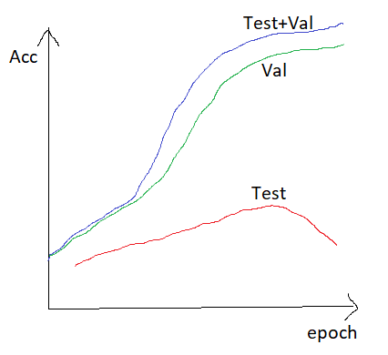
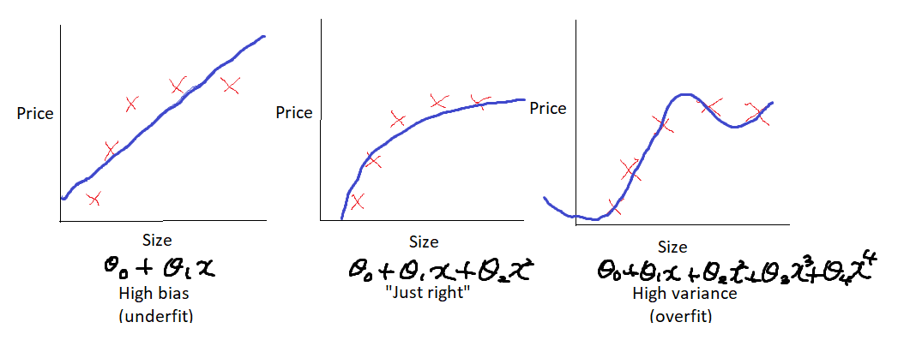
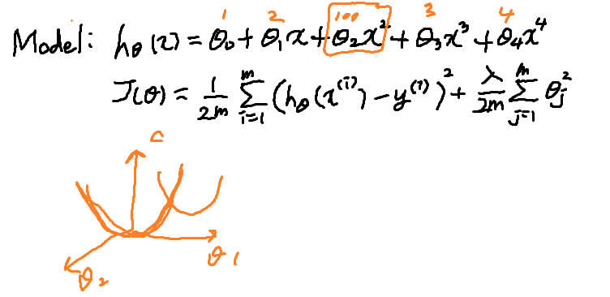

# [Tensorflow] Lab07-2 Application & Tips

## Overfitting

- 과하게 맞춰져있다.



- 학습이 반복될 수록 모델이 맞춰져가면서 Acc가 올라감
- 평가(Val)하는데 정확도가 어느 정도에 위치하게 되는데 과정에서 사용한 데이터에만 평가하다보니 모델에 맞게 잘 되었음 확인 가능
- 그러나 다른 데이터로 Test할 때, 정확도(Acc)가 떨어져버리는 경우가 있다.

- Test+Val이 최고의 Acc를 보이는 게 가장 중요하다



- High bias:
  - 학습이 덜 된 상태
- Just right:
- High variance(overfit):
  - 데이터에만 맞게 되는 경우(variation이 높은 경우)

### Set a features

- 데이터를 더 많이 넣는 방법

  - 데이터 많이 넣음으로서 변화량 희석

- feature 수 줄이는 것(차원 줄임 => 의미를 분명하게 함)

  - 의미 통해 모델을 더 잘 찾을 수 있음

  - PCA라는 방식

  - ```python
    from sklearn.decomposition.import PCA
    pca = decomposition.PCA(n_components=3)
    pca.fit(X)
    X = pca.transform(X)
    ```

- feature의 수를 증가시키는 것

  - 모델이 너무 simple한 경우 복잡하게 만들어줘야 함

- feature수가 많아지면 오히려 error가 올라가는 경우
  - feature수를 적절히 찾아 최솟값 찾는다.

## Regularization (Add term to loss)

- 학습 과정에서 특정값 추가하여 적용

- 람다값(term)을 주어 해결 가능

- 모델 파라미터 값과 람다값 주어 정규화 가능

- 람다 통해 모델 평균값 -> 파라미터들 정규화 가능

- Linear regression with regularization

- 

- 람다값 감소할수록 under fitting

- 람다값 증가할수록 overfitting

- 평평한 구간으로 만들어줌

  ```python
  L2_loss = tf.nn.l2_loss(w) # output = sum(t ** 2) / 2
  ```

## Solutions

- Feature Normalization
- Regularization
- More Data(Data Argumentation)
  - Color Jilttering(색상 다양하게)
  - Horizontal Flips(뒤집기)
  - Random Crops(적절한 크기로 자르든지)/Scales(사이즈 크게 하든지)
- Dropout(0.5 is common)
- Batch Normalization

