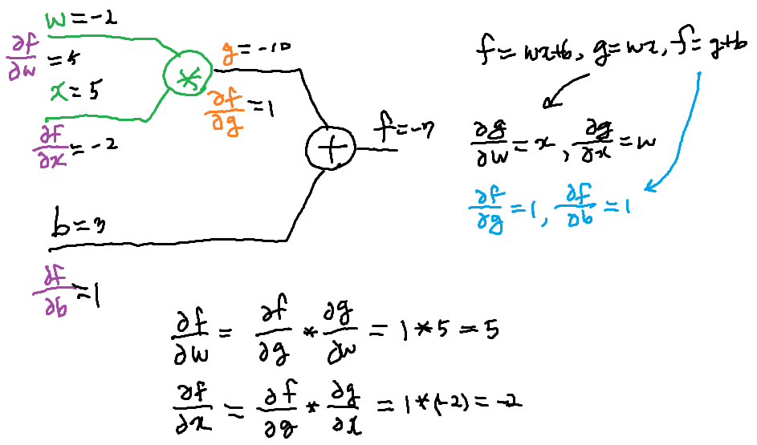
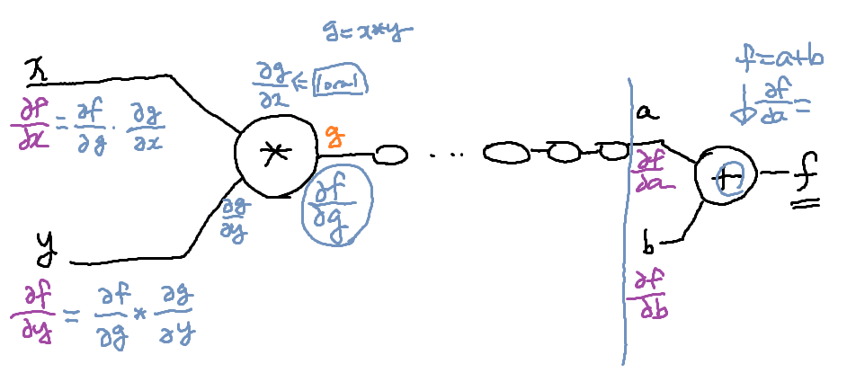
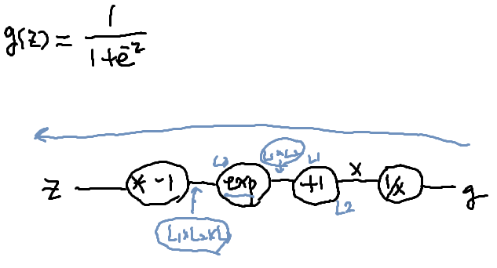

# lec 9-2: 딥넷트웍 학습 시키기(backpropagation)

- 어떻게 자동적으로 w1,w2, b1, b2를 학습시킬 수 있을까?
  - Gradient Descent 알고리즘
    - 초기값이 어떻든 상관없이 해당 점의 접선의 기울기를 구해서 global minimum에 도착 -> cost 최소화
    - 이거 구현 위해 미분값이 필요함
    - 미분 계산해야 함

## Derivation

- 노드가 너무 많아...
- 수학적으로 계산이 어렵다.
- 그래서 Minsky가 '아무도 못한다'고 책을 쓴 것...

## Backpropagation

- Paul 과 Hinton 교수 통해 문제 해결
- - 실제 예측값 & 실제 값과 비교 -> cost를 뒤에서 앞으로 쭉 돌려서 미분값과 뭘 수정해야 하는 지를 계산하겠다.

### Back propagation (chain rule)

- 

- forward(w=-2, x=5, b=3)
  - 그래프에 값 입력시킴
- backward
  - 

## Sigmoid

- 

- chain rule 통해 미분값들을 역으로 추적할 때마다 곱함

- ```python
  cost = -tf.reduce_mean(Y*tf.log(hypothesis) + (1-Y)*tf.log(1-hypothesis))
  ```

- 이미 텐서플로우에서 구현해둔 그래프가  있다.